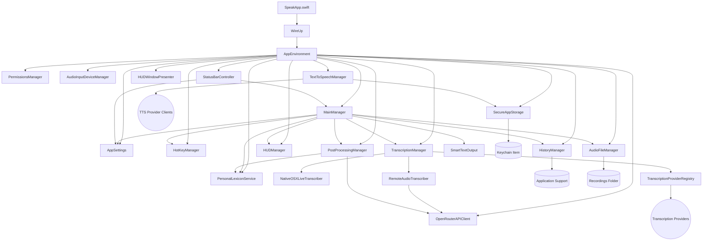

# SpeakApp Architecture

## Top-Level Overview

## Module Responsibilities

- **SpeakApp.swift** bootstraps the dependency graph through `WireUp.bootstrap()`, installs the `AppEnvironment` into SwiftUI, and presents the primary window. It also triggers status bar installation and HUD presentation.
- **WireUp** constructs the shared `AppEnvironment` using "eight lines of code" composition. Each dependency is created once, then injected into collaborators so modules can be developed and tested independently.
- **AppEnvironment** owns long-lived services (`AppSettings`, `PermissionsManager`, etc.), exposes them as read-only properties to the UI layer, and handles late-bound features such as the status bar controller.
- **AppSettings** persists user preferences (transcription models, output behaviour, TTS defaults) through `UserDefaults`, while delegating secure secrets to `SecureAppStorage`. It publishes updates so downstream modules react to configuration changes.
- **PermissionsManager** unifies macOS permission flows (microphone, speech recognition, accessibility, keychain) behind async APIs and cached results.
- **SecureAppStorage** stores all API keys in a single keychain item (`speak-app-secrets` service `com.github.speakapp.credentials`), keeps an in-memory cache, migrates legacy per-key entries, and registers identifiers back into settings for discovery.
- **HotKeyManager** watches Fn-tap gestures via event taps and NSEvent monitors, emits debounced `HotKeyEvent` values, and syncs gesture preferences with `AppSettings`.
- **AudioInputDeviceManager** enumerates Core Audio inputs, observes hardware/default changes, and coordinates temporary device switches during live capture.
- **AudioFileManager** records audio with `AVAudioEngine`, writes crash-safe CAF files into the recordings directory, exposes cleanup utilities, and returns session summaries to `MainManager`.
- **TranscriptionManager** orchestrates live and batch transcription. It wires `NativeOSXLiveTranscriber` for on-device sessions, routes batch work through `TranscriptionProviderRegistry` when a provider-specific client exists, and falls back to `RemoteAudioTranscriber` (OpenRouter) for legacy models. It resolves API keys via `SecureAppStorage` and reports partial results to the UI.
- **TranscriptionProviderRegistry** keeps a catalogue of external transcription providers (OpenAI, Rev AI, etc.), including metadata, supported models, API key requirements, and validation helpers.
- **OpenRouterAPIClient** centralises REST traffic for transcription, chat/post-processing, and model metadata. It handles retries, cost attribution, and secure credential lookup.
- **PostProcessingManager** conditionally sends transcripts (plus personal lexicon context) to LLM backends via `OpenRouterAPIClient`, applies responses, and returns enriched text alongside cost information.
- **PersonalLexiconService** augments transcripts with organisation- or user-specific terminology, driven by the persistent `PersonalLexiconStore`.
- **TextToSpeechManager** coordinates synthesis requests across provider clients (system voices, OpenAI, ElevenLabs, Azure), tracks progress, persists usage history, and optionally auto-plays or exports audio based on settings.
- **HUDManager** owns the session HUD state machine with phases `.hidden`, `.recording`, `.transcribing`, `.postProcessing`, `.delivering`, `.success`, and `.failure`. It maintains per-phase timers and auto-hides terminal states.
- **HUDWindowPresenter** attaches the HUD window and mirrors `HUDManager.snapshot` updates onto screen.
- **HistoryManager** serialises `HistoryItem` records, appends session metrics, stores network exchanges, and exposes Combine publishers for dashboard visuals.
- **SmartTextOutput** encapsulates text delivery. It prefers `AccessibilityTextOutput` when accessibility permissions are granted and falls back to `PasteTextOutput`, which temporarily replaces the clipboard and restores it when configured.
- **MainManager** is the orchestration hub. It reacts to hotkeys/UI actions, coordinates recording, transcription, post-processing, smart output delivery, lexicon corrections, HUD transitions, and history logging. It also surfaces state to SwiftUI (`idle`, `recording`, `processing`, `delivering`, `completed`, `failed`).
- **StatusBarController** exposes quick controls, recent history, and settings shortcuts from the menu bar while reusing `MainManager` and `AppSettings` state.
- **UI Layer** (`MainView`, `SideBarView`, `DashboardView`, `HistoryView`, `SettingsView`, `HUDView`, `StatusBarView`, etc.) binds to environment objects, issues commands to managers, and renders status updates.

## Data Flow Summary

1. **Initiation**: A hotkey gesture or UI button triggers `MainManager.startSession`, which validates settings and spins up recording.
2. **Recording**: `AudioFileManager` begins streaming audio; optional live transcription is started via `TranscriptionManager` using the current audio input from `AudioInputDeviceManager`. `HUDManager` enters `.recording`.
3. **Live Feedback**: `TranscriptionManager` publishes partial text for live preview. Any permission errors are surfaced immediately through `HUDManager` and `MainManager` state.
4. **Submission**: When recording stops, `MainManager` switches to `.processing`, asks `TranscriptionManager` to run batch transcription using either a provider client from `TranscriptionProviderRegistry` or the OpenRouter fallback.
5. **Lexicon & Post-Processing**: Completed transcripts pass through `PersonalLexiconService` for substitutions and, if enabled, `PostProcessingManager` for LLM clean-up. HUD advances through `.transcribing` and `.postProcessing`.
6. **Delivery**: `SmartTextOutput` inserts the final text via accessibility APIs or a clipboard-driven Command+V fallback (`HUDManager` enters `.delivering`). Any delivery errors short-circuit to `.failure`.
7. **Persistence & Analytics**: `HistoryManager` records the session (audio URL, events, costs, lexicon tags). Dashboard charts and the status bar update via Combine publishers.
8. **Follow-up Services**: Optional text-to-speech playback or exports run through `TextToSpeechManager` using provider credentials from `SecureAppStorage`.

## Key State Machines

- **HUDManager** transitions through `.recording → .transcribing → .postProcessing → .delivering → .success|.failure`, updating elapsed timers for each visible phase and auto-hiding after terminal states.
- **HotKeyManager** manages gesture recognition with debounced taps/holds and automatic recovery if the CGEvent tap drops.
- **MainManager** tracks session lifecycle (`idle`, `recording`, `processing`, `delivering`, `completed`, `failed`), ensuring mutually exclusive phases and cleaning up resources on error or cancellation.

## Threading Model

- User-facing managers conform to `@MainActor`, keeping SwiftUI interactions and published state on the main thread.
- Long-running IO (audio capture, network requests, keychain access) executes on dedicated actors/queues, with results marshalled back to the main actor via `Task { @MainActor ... }` or Combine.

## Extension Points

- Register new transcription providers by adding them to `TranscriptionProviderRegistry` (metadata, supported models, client implementation).
- Implement additional post-processing or TTS backends by supplying new clients that honour existing protocols and inject them during `WireUp`.
- Extend status menu options through `StatusBarController`'s menu builder or dashboard visualisations by subscribing to `HistoryManager` publishers.

## Error Handling

- Recoverable errors propagate to `MainManager`, which logs failures, updates history, and drives HUD failure states with actionable messaging.
- Permission issues prompt `PermissionsManager` to request access and report missing capabilities to both HUD and Settings views.
- Network and storage errors capture payload excerpts within `HistoryItem.networkExchanges` for later debugging.

## Resources & Styling

- App and status bar icons are generated programmatically to maintain consistency with light/dark appearances.
- The UI keeps a neutral foundation with accent colours derived from user settings.
- HUD animations use `TimelineView` to balance responsiveness with low CPU overhead.
