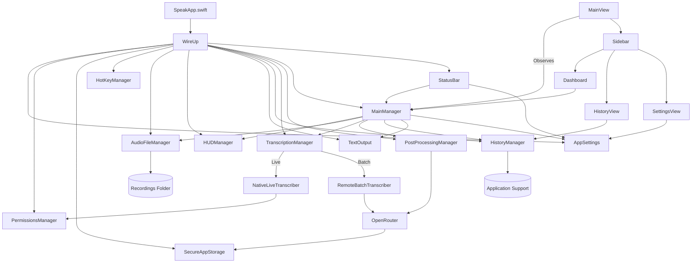

# SpeakApp Architecture

## Top-Level Overview

## Module Responsibilities

- **SpeakApp.swift** bootstraps dependency graph through `WireUp` then renders `MainView`. It also applies runtime resources such as the dynamic app icon.
- **WireUp** aggregates macOS services and constructs shared singletons using the eight-lines-of-code composition pattern. The wiring yields a `MainEnvironment` that the UI injects via environment objects.
- **AppSettings** encapsulates persisted configuration. It uses `UserDefaults` for non-sensitive values and defers API secrets to `SecureAppStorage`. It exposes Combine publishers for reactive updates.
- **PermissionsManager** normalises macOS permission flows (microphone, speech recognition, accessibility, input monitoring) with async request APIs and cached status introspection.
- **SecureAppStorage** provides Keychain-backed storage with an in-memory cache. It cooperates with `AppSettings` to maintain a list of known credentials without touching the Keychain unnecessarily.
- **HotKeyManager** owns the global Fn gesture detector. It emits `HotKeyEvent` values (singleTap, doubleTap, holdStart, holdEnd) to registered listeners, keeps timing tunables in sync with `AppSettings`, and falls back through event taps, NSEvent monitors, and polling to stay resilient.
- **AudioFileManager** streams audio through `AVAudioEngine` into CAF files while exposing utilities for listing, deleting, and migrating recordings. It guarantees data durability by writing to a crash-safe staging directory before moving into the archive folder.
- **TranscriptionManager** orchestrates live and batch modes behind a unified async API. It fans out to `NativeLiveTranscriber` for on-device SFSpeechRecognition and `RemoteBatchTranscriber` for OpenRouter uploads.
- **PostProcessingManager** wraps the chat LLM protocol, sending cleaned-up prompts when enabled and returning enriched transcripts.
- **OpenRouterAPIClient** unifies chat and transcription HTTP calls, using modern concurrency, retries, and cost calculation helpers.
- **HUDManager** maintains the session state machine (`idle → recording → transcribing → postProcessing → delivering → complete|error`) and timers for each phase. It publishes `HUDSnapshot` models that `HUDView` renders.
- **HistoryManager** serialises `HistoryItem` models to an Application Support JSON log. It indexes by session identifier and exposes filters, sections, and aggregated metrics for analytics.
- **TextOutput** contains both accessibility-driven insertion (`AccessibilityTextOutput`) and clipboard fallbacks (`PasteTextOutput`), exposing a unified `SmartTextOutput` façade used by `MainManager`.
- **MainManager** is the orchestration hub. It reacts to hotkeys, coordinates audio capture, drives the HUD, chains transcription and post-processing, handles error recovery, logs history, and triggers text output.
- **UI Layer** (`MainView`, `SideBarView`, `DashboardView`, `HistoryView`, `SettingsView`, `StatusBarView`, `HUDView`) reads from environment objects, kicks off commands on the managers, and surfaces status visually. The UI follows SwiftUI best practices with modular subviews and responsive layouts.

## Data Flow Summary

1. **Trigger**: A hotkey event or UI button informs `MainManager` to start a session.
2. **Recording**: `MainManager` tells `AudioFileManager` to begin capturing, updates `HUDManager`, and optionally starts live transcription via `TranscriptionManager`.
3. **Transcription**: When recording stops, audio is streamed to either the live accumulator result or to a batch request on the remote client. Errors propagate back through `MainManager` and `HUDManager`.
4. **Post-processing**: If enabled, `PostProcessingManager` enriches the transcript.
5. **Output**: `MainManager` calls `TextOutput` with the final text. Delivery mode respects settings and permissions.
6. **History**: The entire session is captured as a `HistoryItem` and saved to disk. Aggregated statistics update the dashboard and status bar.
7. **UI Feedback**: `HUDView`, `StatusBarView`, and the main content refresh via observed state.

## Key State Machines

- **HUDManager** ensures mutually exclusive phases with timed durations. Each transition logs metrics used by analytics.
- **HotKeyManager** implements a debounced gesture recogniser with hold/double-tap semantics and auto-recovery from CGEvent tap failures.
- **MainManager** tracks session lifecycle with an enum backing `@Published` view state (`idle`, `recording`, `processing`, `delivering`, `completed`, `error`).

## Threading Model

- UI updates run on the main actor.
- Long-running IO (recording, network, keychain) occurs on dedicated actors/queues.
- Combine publishers from managers are bridged onto the main queue before binding to SwiftUI state.

## Extension Points

- Swap transcription/post-processing backends by supplying new `LiveTranscriber`/`BatchTranscriber`/`ChatLLMClient` implementations to `WireUp`.
- Augment the dashboard by subscribing to `HistoryManager.statsPublisher`.
- Extend status menu commands via `StatusBarController`'s menu builder closure.

## Error Handling

- Recoverable errors bubble to `MainManager` which updates UI, history, and HUD accordingly.
- Critical permission failures present actionable guidance in both settings and status menu.
- All network/storage errors are logged with payload excerpts in the associated `HistoryItem` for troubleshooting.

## Resources & Styling

- App icon and status bar imagery are generated programmatically for consistency with adaptive appearance.
- The UI uses a neutral palette with accent highlights derived from the selected appearance in settings.
- Animations for HUD phases rely on `TimelineView` to keep CPU impact low.
