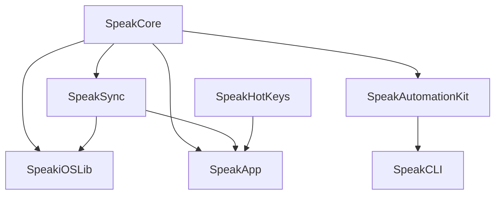

# Architecture

This document describes the repository at commit `2ff982d` (12 September 2026). It is a current-state map, not a
target architecture. Feature-gated targets are declarations in the build manifest; their presence does not prove that
provisioning or distribution has been completed.

## Module and build map

The repository has three build graphs:

- [Package.swift](../Package.swift) owns reusable modules, the macOS executable, CLI, demo, benchmark and host tests.
- [Project.swift](../Project.swift) owns generated Apple app, extension and UI-test targets. It consumes products from
  the local root package. [Workspace.swift](../Workspace.swift) generates the `Just Speak to It` workspace containing
  the root project; generated Xcode projects are not hand-maintained declarations.
- [Tooling/Package.swift](../Tooling/Package.swift) is an independent SwiftLint dependency graph, isolated from the app
  and test resolver.

The root package declares macOS 14 and iOS 17 as its package platforms. That declaration does not mean every target is
host-buildable for both platforms: `SpeakApp` imports macOS frameworks, while `SpeakiOSLib` contains iOS-guarded code.

### Root Swift package

| Target | Kind | Direct internal dependencies / role |
| --- | --- | --- |
| `CTranscribe` | binary | Remote transcribe.cpp XCFramework used only by the benchmark executable. |
| `SpeakHotKeys` | library target | Global-hot-key implementation. |
| `SpeakCore` | library target | Shared catalogues, protocols, models, capture policies and resources. |
| `SpeakSync` | library target | Depends on `SpeakCore`; CloudKit history, comparison and encrypted-key sync. |
| `SpeakiOSLib` | library target | Depends on `SpeakCore` and `SpeakSync`; iOS views and services. |
| `SpeakAutomationKit` | library target | Depends on `SpeakCore`; CLI parsing, socket client and MCP server. |
| `SpeakCLI` | executable target | Depends on `SpeakAutomationKit` and `SpeakCore`; product name `speak`. |
| `SpeakApp` | executable target | Depends on `SpeakCore`, `SpeakSync`, `SpeakHotKeys` and external macOS packages. |
| `SpeakHotKeysDemo` | executable target | Depends on `SpeakHotKeys`; development demo. |
| `LocalTranscriptionBenchmarkKit` | library target | Depends on `SpeakCore`; benchmark measurement and result support. |
| `LocalTranscriptionBenchmark` | executable target | Depends on the benchmark kit, WhisperKit and `CTranscribe`; product name `local-transcription-benchmark`. |
| `SpeakCoreTests` | test target | Tests `SpeakCore`. |
| `SpeakHotKeysTests` | test target | Tests `SpeakHotKeys`. |
| `SpeakSyncTests` | test target | Tests `SpeakSync`. |
| `SpeakAppTests` | test target | Tests `SpeakApp`, automation, hot keys, Sentry and WhisperKit-backed storage seams. |
| `SpeakAppSnapshotTests` | test target | Tests `SpeakApp` with SnapshotTesting. |
| `SpeakiOSTests` | test target | Host package tests for `SpeakiOSLib`. |
| `SpeakAutomationKitTests` | test target | Tests `SpeakAutomationKit` and `SpeakCore`. |
| `LocalTranscriptionBenchmarkTests` | test target | Tests the benchmark kit and its `SpeakCore` contract. |

The products are `SpeakHotKeys`, `SpeakCore`, `SpeakSync`, `SpeakiOSLib`, `SpeakAutomationKit`, `SpeakApp`, `speak` and
`local-transcription-benchmark`. The benchmark and `CTranscribe` are part of the root graph at this inspected base.

```mermaid
flowchart TD
    Core[SpeakCore] --> Sync[SpeakSync]
    Core --> IOSLib[SpeakiOSLib]
    Sync --> IOSLib
    Core --> Automation[SpeakAutomationKit]
    Automation --> CLI[SpeakCLI]
    Core --> Mac[SpeakApp]
    Sync --> Mac
    HotKeys[SpeakHotKeys] --> Mac
```

Each arrow points from a dependency to the target that consumes it.

### Tuist targets

| Target | Product / deployment | Inclusion and direct local relationship |
| --- | --- | --- |
| `SpeakApp` | macOS app, 14.0 | Always; consumes package `SpeakCore`, `SpeakSync`, `SpeakHotKeys` and external products. Sparkle is direct-build only. |
| `SpeakiOS` | iOS app, 17.0 | Always; sources are `SpeakiOSApp/**`; consumes `SpeakCore`, `SpeakiOSLib`, `SpeakSync` and the iOS widget. |
| `JustSpeakToItWidgetExtension` | iOS extension, 17.0 | Always; consumes package `SpeakCore` and `SpeakiOSLib`. |
| `JustSpeakKeyboard` | iOS extension, 17.0 | `TUIST_IOS_KEYBOARD`; consumes package `SpeakCore`. Direct capture has the separate `TUIST_IOS_KEYBOARD_DIRECT_CAPTURE` gate. |
| `JustSpeakShare` | iOS extension, 17.0 | `TUIST_IOS_SHARE_EXTENSION`; consumes package `SpeakCore`. |
| `JustSpeakWatchApp` | watchOS app, 10.0 | `TUIST_WATCH_APP`; embeds the watch widget and directly compiles selected `SpeakCore` files. |
| `JustSpeakWatchWidgetExtension` | watchOS extension, 10.0 | Same Watch gate; directly compiles shared Watch and selected `SpeakCore` files. |
| `CoreJourneyFixtureApp` | macOS app | Always; fixture used by UI tests. |
| `SpeakAppUITests` | macOS UI tests | Always; depends on `SpeakApp` and `CoreJourneyFixtureApp`. |
| `SpeakiOSUITests` | iOS UI tests, 17.0 | Always; depends on `SpeakiOS`. |
| `SpeakiOSTests` | iOS unit tests, 17.0 | Always; depends on `SpeakiOS`, package `SpeakCore` and `SpeakiOSLib`; adds selected keyboard sources when its gate is on. |

`SHOW_OPENCLAW_TAB` adds its iOS compilation condition. `TUIST_APP_STORE` selects the sandboxed macOS App Store
identity and entitlement set; it is independent of `TUIST_RELEASE_TRAIN`, which selects Stable or Alpha identities.
The Watch targets do not depend on the `SpeakCore` package product because transitive package manifests do not declare
watchOS support. Their `Project.swift` source lists are direct shared-source inclusion, not module dependency arrows.

## Shared responsibilities

| Concern | Current owner |
| --- | --- |
| Model catalogue and placement | [ModelCatalog.swift](../Sources/SpeakCore/ModelCatalog.swift), [ModelRouting.swift](../Sources/SpeakCore/ModelRouting.swift) and provider-specific shared catalogues. |
| Live routes and client construction | [LiveTranscriptionSelection.swift](../Sources/SpeakCore/LiveTranscriptionSelection.swift) and [LiveTranscriptionClientFactory.swift](../Sources/SpeakCore/LiveTranscriptionClientFactory.swift). |
| Batch-provider contract and metadata | [TranscriptionProviderRegistry.swift](../Sources/SpeakCore/TranscriptionProviderRegistry.swift) defines `TranscriptionProvider` and metadata. The concrete macOS actor is a different file with the same name under [SpeakApp](../Sources/SpeakApp/TranscriptionProviderRegistry.swift). |
| Capture start and opening audio | [RecordingStartSequence.swift](../Sources/SpeakCore/RecordingStartSequence.swift) contains `RecordingStartSequencer`; [StreamingAudioPreroll.swift](../Sources/SpeakCore/StreamingAudioPreroll.swift) retains ordered opening buffers. |
| Language, results, keychain and privacy-safe types | `SpeakCore`, including [SecureStorage.swift](../Sources/SpeakCore/SecureStorage.swift), [SensitiveHeaderRedactor.swift](../Sources/SpeakCore/SensitiveHeaderRedactor.swift) and closed analytics dimensions. |
| Lexicon | [PersonalLexiconService.swift](../Sources/SpeakCore/PersonalLexiconService.swift) and `PersonalLexiconStore`. |
| Extension protocols and stores | Keyboard handoff/delivery, App Group availability, shared recording inbox, Watch capture and complication files in [SpeakCore](../Sources/SpeakCore/). |
| History presentation | [HistoryPresentation.swift](../Sources/SpeakCore/HistoryPresentation.swift) supplies shared display rules; each platform owns its richer persisted record. |
| Release identities | [ReleaseTrains.json](../Sources/SpeakCore/Resources/ReleaseTrains.json) is canonical; generated Swift exposes the selected train. |

Shared catalogue ownership does not make every adapter platform-neutral. A provider addition can require catalogue,
credential, route, transport, platform registration, settings and tests according to the provider's live/batch and
platform capabilities.

## macOS runtime

[SpeakApp.swift](../Sources/SpeakApp/SpeakApp.swift) is the executable entry point. [WireUp.swift](../Sources/SpeakApp/WireUp.swift)
constructs the long-lived `AppEnvironment`, injects services, installs optional analytics and sync adapters, and makes
the environment available to SwiftUI and App Intents. `AppSettings`, `PermissionsManager`, audio devices and capture,
transcription, post-processing, TTS, history, HUD, hot keys, output delivery and local transports live for the process.

`MainManager` owns the dictation session lifecycle and coordinates recording, transcription, optional polishing,
delivery, HUD transitions and history finalisation. `SmartTextOutput` chooses accessibility insertion or paste/clipboard
fallback. Cancellation is scoped to the active session/run, and live-controller teardown waits for provider startup
where necessary so a late start cannot capture for a replacement run.

[SwitchingLiveTranscriber.swift](../Sources/SpeakApp/SwitchingLiveTranscriber.swift) is deliberately mixed today:

- dedicated macOS controllers handle Deepgram, Modulate, AssemblyAI, ElevenLabs, Soniox, Cartesia, Gladia and OpenAI
  Realtime;
- `SharedClientLiveController` supplies macOS capture for the shared `SpeakCore` clients used by Gemini live, xAI,
  Azure, Meta, Speechmatics, Rev.ai and Mistral;
- Apple legacy/analyzer, FluidAudio Parakeet, WhisperKit and the non-App-Store sherpa-onnx runtime have local controllers.

Batch transcription first asks the concrete macOS `TranscriptionProviderRegistry`, then uses the OpenRouter batch
fallback for legacy models. Apple Speech Analyzer and downloaded local models take local paths before that registry.
This is not a guarantee that all providers share transport or identical result metadata.

The existing Compare Models feature is another capture consumer. `CompareModelsController` reserves capture ownership;
[ComparisonLiveFanOut.swift](../Sources/SpeakApp/CompareModels/ComparisonLiveFanOut.swift) sends one microphone capture
through per-candidate `ComparisonLiveLane` instances, retains the common PCM capture, and stores blinded rounds in
`ComparisonRoundStore`. File comparison has its own runner, and `MacComparisonSyncAdapter` bridges rounds to `SpeakSync`.

## iOS runtime

[SpeakiOSApp.swift](../SpeakiOSApp/SpeakiOSApp.swift) and `SpeakiOSAppDelegate` are the app/launch roots. The delegate
can receive history pushes, Watch transfers and quick actions before foreground SwiftUI is active. Deep links are
queued until the scene is active before microphone capture begins.

There is no `IOSWireUp` or `IOSAppEnvironment` at this base. UI, intents, keyboard handoff and Watch import converge on
the `@MainActor` singleton [TranscriptionRecordingService](../Sources/SpeakiOS/Services/TranscriptionRecordingService.swift),
with injectable seams for tests. `ForegroundRecordingOwnership` prevents a foreground capture and an App Intent from
claiming the process microphone concurrently. `SharedTranscriptionState` publishes bounded App Group state for widgets,
extensions, Live Activity result actions and background completions.

[IOSTranscriptionSession.swift](../Sources/SpeakiOS/Services/IOSTranscriptionSession.swift) resolves four backend kinds:

- batch records first, then `IOSBatchTranscriptionClient` selects Apple Speech Analyzer, provider-specific/shared batch
  clients, or OpenRouter according to the selected model;
- Apple live uses the iOS Apple transcriber, with its legacy fallback;
- OpenAI Realtime keeps its platform-specific iOS WebSocket transcriber;
- other iOS-supported live routes use `SharedClientLiveTranscriber` and the `SpeakCore` client factory.

All backends feed the service's common start, stop, cancellation, recording-safety, history and activity completion
boundaries, but batch intentionally has no partial transcript. App Intents may launch and execute in the app process
without the foreground scene, so scene construction is not the only lifecycle entry.

## Extensions and companion surfaces

| Surface | Source / gate | Transport and storage role |
| --- | --- | --- |
| iOS keyboard | [JustSpeakKeyboard](../JustSpeakKeyboard/); keyboard gate, plus separate direct-capture gate | Default handoff writes request/status through the App Group for app-owned capture. The optional compiled direct path uses Apple Speech inside the extension and can degrade to handoff. |
| Share extension | [JustSpeakShare](../JustSpeakShare/); share gate | Streams an existing audio attachment into `SharedRecordingInbox`, commits its manifest last, and leaves transcription and credentials to the app. |
| iOS widget / Live Activity controls | [JustSpeakToItWidgetExtension](../JustSpeakToItWidgetExtension/); always declared | Reads shared transcription/recording state and invokes App Intents; it does not own the transcription pipeline. |
| Watch app | [JustSpeakWatch](../JustSpeakWatch/) and [JustSpeakWatchShared](../JustSpeakWatchShared/); Watch gate | Records on Watch and queues files through WatchConnectivity. Local audio remains until a durable iPhone import/transcription acknowledgement permits deletion. |
| Watch complication / Smart Stack | [JustSpeakWatchWidget](../JustSpeakWatchWidget/); Watch gate | Reads Watch App Group snapshots and uses a system recording intent on watchOS 11+, with an app-opening fallback on watchOS 10. |

See the [keyboard/TestFlight runbook](ios-testflight-release.md) and [Watch provisioning runbook](watch-provisioning.md).
Feature flags control generated target inclusion and source conditions; signing profiles, entitlements and device
behaviour remain separate release checks.

## Persistence and sync

macOS `HistoryManager` stores rich `HistoryItem` records and coordinates file IO through the
[HistoryWALStore](../Sources/SpeakApp/HistoryWALStore.swift) actor. The write-ahead log, snapshot and recovery paths keep
pending operations ordered. iOS uses `@MainActor` `iOSHistoryManager` with a primary JSON snapshot plus the synchronous
[IOSHistoryPersistence](../Sources/SpeakiOS/Views/IOSHistoryPersistence.swift) recovery sidecar. These are different
local storage implementations.

CloudKit history sync projects both records onto exactly nine `SyncableHistoryEntry` fields: `id`, `createdAt`,
`rawTranscription`, `postProcessedText`, `model`, `duration`, `wordCount`, `originPlatform` and `updatedAt`.
[SyncRecord.swift](../Sources/SpeakSync/SyncRecord.swift) maps that projection. Local diagnostics, error details, costs,
model-usage arrays and audio/file references do not join that projection automatically.

`CloudKitKeySync` encrypts a bounded set of credential identifiers: Deepgram, OpenAI transcription, OpenRouter,
ElevenLabs, Cartesia, AssemblyAI, Gladia, Google, Modulate, Soniox, xAI and Meta. It is not a sync of every credential.
QR `ConfigTransferManager` has a different explicit credential allow-list and transfers only two string settings:
`selectedModel` and `transcriptionKeywords`. `SettingsSync` remains a public `NSUbiquitousKeyValueStore` wrapper with
six `SyncKey` cases, availability/status behaviour and local fallback; it is distinct from QR transfer.

For Stable, [ReleaseTrains.json](../Sources/SpeakCore/Resources/ReleaseTrains.json) currently selects iOS container
`iCloud.com.justspeaktoit.ios` and macOS container `iCloud.com.justspeaktoit`; Alpha has separate counterparts.
`SpeakSync.SyncConfiguration` uses `TranscriptionHistoryZone` and selects the platform's current-train container.
Any container consolidation is an undecided migration, not current behaviour.

## Automation

The macOS [AutomationServer](../Sources/SpeakApp/Transport/AutomationServer.swift) accepts owner-only local UNIX-socket
connections. `AppAutomationHandler` maps status, history, file transcription and dictation commands onto the same
managers as the UI. `SpeakCLI` is a thin socket client; `SpeakAutomationKit` owns parsing, framing,
`MCPRequestHandler` and the stdio `MCPStdioServer`. The separate Bonjour transport is used for cross-device transcript
delivery, not same-machine CLI control.

iOS exposes App Intents for recording, transcription files and result actions. Those intents invoke
`TranscriptionRecordingService`; they do not expose the macOS socket or an invented remote-control service. See
[automation.md](automation.md) for commands and contracts.

## Observability and privacy boundaries

`SentryManager` installs [SentryEventScrubber.swift](../Sources/SpeakApp/SentryEventScrubber.swift) before events and
breadcrumbs leave the app. It removes/redacts sensitive headers, URL/query credentials, cookies, contexts and extras.

Direct non-App-Store macOS builds may construct the explicit-consent [PostHogAnalytics.swift](../Sources/SpeakApp/PostHogAnalytics.swift)
sink. Missing configuration is a no-op; opt-out closes/purges the queue. `SpeakCore` defines typed event properties and
closed/bounded dimensions in `ProductAnalytics`, while iOS does not initialise the PostHog transport. Definitions and
call sites are not proof of production coverage or rollout. The [implementation audit](analytics-implementation-audit.md)
and [analytics plan](analytics-plan.md) record the outstanding evidence and gates.

## Build and release

`ReleaseTrains.json` owns Alpha/Stable identities. `scripts/generate-release-train-config.py` regenerates its Swift
representation, and [Project.swift](../Project.swift) derives bundle IDs, groups, containers, schemes, product names and
feeds from the selected train. [ReleasePipeline.json](../Config/ReleasePipeline.json), not prose copied elsewhere,
records commissioning state; at this base its `enabled` value is `true`.

Successful main CI can allocate an immutable Alpha manifest and dispatch independent Mac direct, Mac App Store and iOS
workers. Upload, processing, TestFlight assignment, merge success and public delivery are distinct states. Stable starts
with an owner-selected Alpha source and `prepare-stable.yml`; `publish-stable.yml` requires the repository owner to
supply the exact reviewed frozen-manifest SHA-256. See the [Alpha and Stable release-train guide](alpha-stable-release-trains.md).

## Concurrency boundaries

- `AppEnvironment`, `MainManager`, `HistoryManager`, the macOS live controllers, `TranscriptionRecordingService`,
  `iOSHistoryManager` and iOS session coordination are concrete `@MainActor` owners of UI/session state.
- `HistoryWALStore` is an actor that serialises macOS history snapshot and WAL file operations. iOS history persistence
  is currently synchronous and MainActor-isolated rather than an equivalent storage actor.
- Audio callbacks hand work to serial processing queues in shared-client and Apple/OpenAI iOS transcribers. Bounded
  pumps and cross-callback state use explicit locks where their files declare them; startup/finalisation use tasks and
  checked continuations at named lifecycle seams.
- The root manifest uses Swift tools 5.9. Only `SpeakCore` explicitly enables experimental `StrictConcurrency`, described
  there as warnings under Swift 5 language mode. `Project.swift` does not declare a repository-wide Swift 6 or complete
  strict-concurrency setting.

These are local ownership decisions, not a claim that every IO operation is off the MainActor or that all races have
been eliminated.

## Safe extension points

- Add shared catalogue metadata and route/client support in `SpeakCore`, then register concrete batch or platform
  adapters where the capability requires them. Preserve model-ID migration and catalogue parity tests; stored option
  identifiers and public protocol surfaces are compatibility contracts.
- New live clients implement the streaming/finalisation contracts used by the shared factory; providers that retain a
  dedicated controller must preserve that controller's audio, cancellation and transcript-shape semantics.
- New history fields require an explicit decision about local-only versus the nine-field sync projection and migrations
  on both platform stores.
- New extension features require both manifest/source gates and separate entitlement, profile, transport, storage and
  device validation.
- New automation operations belong in the bounded shared wire schema, then in the app handler and CLI/MCP surfaces;
unsupported fields must fail rather than report an override that was not applied.
