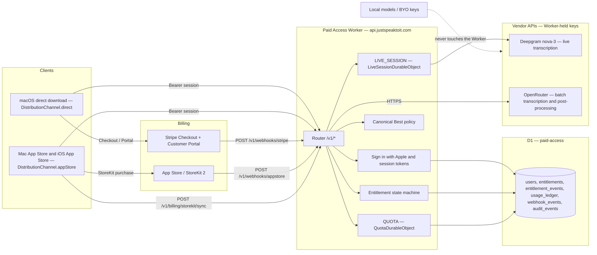

# Paid Access operations runbook

Use this runbook to set up, deploy, verify, and operate the paid access tier. The Worker source and its developer notes live in [`workers/paid-access/README.md`](../workers/paid-access/README.md); user-facing data handling is in [`paid-access-privacy.md`](paid-access-privacy.md).

## Overview

Paid access lets a user subscribe instead of managing vendor API keys. Their transcription and post-processing requests are proxied through a Cloudflare Worker that holds the vendor credentials as Worker secrets.

**Local models and bring-your-own (BYO) API keys remain the default and stay fully supported.** Paid access buys convenience, not capability: it unlocks no feature, model quality tier, or output that a BYO or local user cannot already reach. Every operational decision below follows from that. If paid routing is degraded or switched off, the correct client behaviour is to fall back to BYO keys or local models, not to lose the feature.

| Property | Value |
| --- | --- |
| Runtime | Cloudflare Workers, Durable Objects, D1 |
| Package | `workers/paid-access/` (TypeScript) |
| Production route | `api.justspeaktoit.com/*` |
| Environments | default (development), `staging`, `production` |
| Identity | Sign in with Apple, shared across channels and devices |
| Billing | Stripe (direct-download macOS) or StoreKit 2 (App Store builds) |
| D1 database | `paid-access` (staging: `paid-access-staging`) |

## Architecture



The dashed path matters: BYO and local users never contact our servers. Only paid requests transit the Worker.

## Channel selection rules

| Build | `DistributionChannel` | Billing | Enforcement |
| --- | --- | --- | --- |
| macOS direct download (Developer ID) | `direct` | Stripe Checkout + Customer Portal | `/v1/billing/stripe/*` requires body `{channel:"direct"}` and rejects anything else |
| Mac App Store | `appStore` | StoreKit 2 auto-renewable subscription | `/v1/billing/storekit/sync` with a verified signed transaction |
| iOS App Store / TestFlight | `appStore` | StoreKit 2 auto-renewable subscription | `/v1/billing/storekit/sync` with a verified signed transaction |

The client hides the wrong control for its channel, and the Worker rejects it anyway. Client-side selection is a UX affordance, not the control.

**iOS does not sell paid access yet.** `PaidAccessStore` compiles and can hold an entitlement bought on a Mac, but nothing on iOS routes work through it — `iOSBatchTranscriber`, `VoiceSummariser` and `PostProcessingView` all go straight to the user's own key or an on-device model. The purchase UI is therefore switched off behind `PaidAccessFeature.isAvailableOnIOS` (`Sources/SpeakiOS/Services/PaidAccessStore.swift`) so nobody is charged for routing that does not happen. Wire those three call sites through a proxy client, then flip that constant.

Identity is shared. The same Apple account signing in on a direct-download Mac and on an iPhone resolves to one user row and one entitlement, whichever channel paid for it. A user who subscribes through Stripe on a Mac is entitled on their iPhone without a second purchase.

## External product setup

Everything in this section is manual, done once per environment, and cannot be scripted from the repository.

### Cloudflare

- [ ] Create the D1 databases: `paid-access` and `paid-access-staging`.
- [ ] Paste the returned ids into `wrangler.toml`, replacing `REPLACE_WITH_D1_DATABASE_ID` and `REPLACE_WITH_STAGING_D1_DATABASE_ID`.
- [ ] Create the Worker (`npx wrangler deploy --env staging` creates it on first deploy).
- [ ] Set every secret listed under [Secrets](#secrets), per environment.
- [ ] Add the DNS record and route for `api.justspeaktoit.com` in the `justspeaktoit.com` zone.

```bash
cd workers/paid-access
npx wrangler d1 create paid-access
npx wrangler d1 create paid-access-staging
```

### Stripe

- [ ] Create the product and its recurring prices — one per term you sell (monthly, yearly).
- [ ] Copy every price id into `STRIPE_PRICE_IDS` in `wrangler.toml`, comma-separated, replacing the `price_REPLACE_ME_*` placeholders, for each environment. The first is what Checkout opens with by default. A price missing from this list has its subscription webhooks ignored as another product's, so never remove one that still has subscribers on it.
- [ ] Enable the Customer Portal in Stripe billing settings.
- [ ] Create a webhook endpoint pointing at `https://api.justspeaktoit.com/v1/webhooks/stripe`, subscribed to `customer.subscription.created`, `customer.subscription.updated`, `customer.subscription.deleted`.
- [ ] Copy the endpoint signing secret into `STRIPE_WEBHOOK_SECRET`.

### App Store Connect

- [ ] Create an auto-renewable subscription group.
- [ ] Create the products `com.justspeaktoit.paid.monthly` and `com.justspeaktoit.paid.yearly`, matching `STOREKIT_SUBSCRIPTION_PRODUCT_IDS`.
- [ ] Set the App Store Server Notifications V2 URL to `https://api.justspeaktoit.com/v1/webhooks/appstore`.
- [ ] Add the subscription to `Configuration.storekit` so it can be exercised in the local StoreKit testing environment.

### Apple Developer

- [ ] Enable the **Sign in with Apple** capability for the iOS app id and both macOS app ids.
- [ ] If the direct-download macOS build uses the web sign-in flow, create the Services ID `com.justspeaktoit.signin`.
- [ ] Confirm every audience in use appears in `APPLE_IDENTITY_AUDIENCES`, and every native bundle id in `APPLE_BUNDLE_IDS`.

An identity token whose audience is missing from `APPLE_IDENTITY_AUDIENCES` is rejected with `unauthorized`. That is the most common cause of "sign-in works on iPhone but not on Mac".

## Secrets

Secrets are set per environment and are never committed. `wrangler.toml` contains only non-secret configuration.

```bash
cd workers/paid-access
npx wrangler secret put SESSION_SIGNING_KEY --env production
npx wrangler secret put STRIPE_SECRET_KEY --env production
npx wrangler secret put STRIPE_WEBHOOK_SECRET --env production
npx wrangler secret put OPENROUTER_API_KEY --env production
npx wrangler secret put DEEPGRAM_API_KEY --env production
npx wrangler secret list --env production
```

| Secret | Required | Purpose |
| --- | --- | --- |
| `SESSION_SIGNING_KEY` | Yes | HS256 key for session access tokens; minimum 32 characters |
| `STRIPE_SECRET_KEY` | Yes | Checkout and Customer Portal calls |
| `STRIPE_WEBHOOK_SECRET` | Yes | `Stripe-Signature` verification |
| `OPENROUTER_API_KEY` | Yes | Batch transcription and post-processing |
| `DEEPGRAM_API_KEY` | Yes | Live transcription |
| `OPENAI_API_KEY` | No | Reserved; not used by the current Best paths |
| `APPSTORE_ROOT_CA_G3_BASE64` | No | Overrides the pinned Apple Root CA G3. Testing only |

Rotating `SESSION_SIGNING_KEY` invalidates every access token immediately. Clients recover by refreshing, so rotate deliberately and expect a burst of `/v1/auth/refresh` traffic.

## D1 migrations

Migrations live in `workers/paid-access/migrations/` and are **forward-only**. A deployed migration is never edited and never reversed; a mistake is corrected by a new migration.

```bash
cd workers/paid-access

# Create
npx wrangler d1 migrations create paid-access add_something

# Apply locally, then run the suite (tests apply the real migrations)
npm run migrations:local
npm test

# Apply remotely
npx wrangler d1 migrations apply paid-access-staging --remote --env staging
npm run migrations:remote     # wrangler d1 migrations apply paid-access --remote

# Confirm what has been applied (lists *unapplied* migrations; expect none)
npx wrangler d1 migrations list paid-access --remote
```

`0001_init.sql` creates `users`, `auth_sessions`, `billing_customers`, `entitlements`, `entitlement_events`, `webhook_events`, `usage_ledger` and `audit_events`, plus triggers that make `entitlement_events`, `usage_ledger` and `audit_events` reject `UPDATE` and `DELETE`. Idempotency comes from two UNIQUE constraints: `webhook_events(provider, event_id)` and `usage_ledger(user_id, idempotency_key)`.

Apply migrations before deploying the Worker version that depends on them.

## Webhook verification

| Source | Verification |
| --- | --- |
| Stripe | HMAC-SHA256 over `${timestamp}.${payload}` taken from the `Stripe-Signature` header, compared in constant time, with a 300-second tolerance window |
| Apple (signed transactions and App Store Server Notifications V2) | Full JWS `x5c` chain verification: every certificate signature checked with WebCrypto, validity windows checked, chain pinned to Apple Root CA G3 (SHA-256 `63343ABFB89A6A03EBB57E9B3F5FA7BE7C4F5C756F3017B3A8C488C3653E9179`) by exact DER comparison |
| Sign in with Apple identity tokens | Verified against Apple's JWKS: issuer `https://appleid.apple.com`, audience, expiry, RS256 algorithm, key id, and a mandatory nonce |

Payloads are never merely decoded. Both webhook handlers claim the delivery in D1 by `(provider, event_id)` before changing state, so a replay is acknowledged with 200 and does nothing.

### Test a Stripe delivery

```bash
stripe login
stripe listen --forward-to http://127.0.0.1:8787/v1/webhooks/stripe
# `stripe listen` prints a temporary signing secret; use it as STRIPE_WEBHOOK_SECRET locally.

stripe trigger customer.subscription.created
stripe trigger customer.subscription.updated
stripe trigger customer.subscription.deleted
```

Against a deployed environment, use the Stripe dashboard: **Developers → Webhooks →** the endpoint **→ Send test webhook**, then **Resend** an existing event to confirm the replay is a no-op.

### Replay an App Store notification

In App Store Connect, use **App Information → App Store Server Notifications → Request a Test Notification** to send a signed V2 notification to `https://api.justspeaktoit.com/v1/webhooks/appstore`, then check the delivery history and resend a real notification to confirm idempotency. Confirm the delivery landed:

```bash
npx wrangler d1 execute paid-access --remote \
  --command "select provider, event_type, status, received_at from webhook_events order by received_at desc limit 10"
```

A test notification that returns 401 means the signed payload was rejected. Read the correlation ID from the response and find the verifier error in the logs before changing anything: an invalid signature, a broken or reordered certificate chain, a certificate outside its validity window, a wrong audience or bundle identifier, and a misconfigured production trust root all surface as the same 401. Only once the logged error names the pinned root check should you look at `APPSTORE_ROOT_CA_G3_BASE64`, and then only to confirm nobody set it outside a test environment — if it is set there, unset it.

## Live transcription session lifecycle

Opening `GET /v1/paid/transcribe/live` reserves quota for the maximum session
length and returns an `x-session-id` header on the 101 upgrade response. The
client must send that value back as `session_id` to
`POST /v1/paid/transcribe/live/finalise` when the socket closes, which commits
the measured duration and releases the remainder of the reservation.

**No shipping client opens this socket yet.** The endpoint and its lease
lifecycle are complete on the server, but macOS and iOS still stream through the
user's own key or an on-device model, so the paths below are exercised by the
Worker's own tests rather than by the apps.

If the client never finalises, the reservation is reclaimed when its lease
expires (`MAX_LIVE_SESSION_SECONDS` plus a minute), so a crashed client cannot
hold a concurrency slot indefinitely and cannot under-report usage.

## Quotas

Quotas are enforced by `QuotaDurableObject` with a reserve → finalise/release lease lifecycle, one instance per user.

| Var | Default | Meaning |
| --- | --- | --- |
| `PLAN_MONTHLY_SECONDS` | `180000` | Included audio seconds per billing period (50 hours) |
| `PLAN_MONTHLY_POSTPROCESS_TOKENS` | `20000000` | Included post-processing tokens per billing period |
| `MAX_CONCURRENT_SESSIONS` | `2` | Simultaneous live sessions per user |
| `MAX_LIVE_SESSION_SECONDS` | `1800` | Hard ceiling on one live session, enforced by a Durable Object alarm |
| `MAX_REQUEST_BYTES` | `26214400` | Largest accepted request body (25 MiB) |
| `UPSTREAM_TIMEOUT_MS` | `60000` | HTTPS upstream timeout |
| `LIVE_UPSTREAM_TIMEOUT_MS` | `15000` | Live upstream connect timeout |

To change a quota, edit the value in the relevant `[vars]` block in `wrangler.toml` and redeploy that environment. Limits are read per request, so the new value applies to the next request; reservations already in flight keep the limits they were taken under.

```bash
cd workers/paid-access
$EDITOR wrangler.toml          # edit [env.production.vars]
npx wrangler deploy --env production
```

Exhausted quota returns `quota_exceeded` (HTTP 429); too many live sessions returns `too_many_sessions` (HTTP 429). Neither changes the entitlement.

## Incident kill switch

`PAID_ROUTING_DISABLED` fails paid routing closed without taking the Worker offline and **without revoking anyone's subscription**. Use it for vendor outages, credential compromise, runaway spend, or a bad routing change.

```bash
cd workers/paid-access
$EDITOR wrangler.toml          # [env.production.vars] PAID_ROUTING_DISABLED = "true"
npx wrangler deploy --env production
```

Expected behaviour while it is on:

| Surface | Behaviour |
| --- | --- |
| `/v1/paid/*` | HTTP 503, error code `paid_routing_disabled` |
| `/v1/entitlement`, `/v1/auth/*`, `/v1/billing/*`, `/v1/webhooks/*` | Unaffected; entitlements continue to update |
| Clients | Fall back to BYO keys or local models. Nothing is silently downgraded to a different paid model |
| Usage ledger | No new rows for blocked requests; existing history untouched |

To restore, set it back to `"false"` and redeploy. Record the incident window; refunds or credits are a Stripe/App Store action, not a database edit.

## Rollback

```bash
cd workers/paid-access
npx wrangler versions list --env production
npx wrangler rollback <version-id> --env production --message "Reason for the rollback"
```

`wrangler rollback` takes a **version** id, not a deployment id. Use `wrangler versions list` to find it; `wrangler deployments list --env production` shows what has actually been served.

**D1 migrations are not rolled back.** A Worker rollback reverts code only; the schema stays where it is. If a migration is wrong, write a forward migration that corrects it and deploy that. Never hand-edit a deployed schema, and never attempt to reverse an append-only table.

If the failure is in paid routing rather than in the Worker as a whole, prefer the kill switch: it is one variable and it leaves auth, billing and webhooks working.

## Deployment verification

Run these in order after a production deploy. Each is a separate gate; a green earlier step is not evidence for a later one.

1. **Health.**

   ```bash
   curl -sS -D- -o- https://api.justspeaktoit.com/v1/health
   ```

   Expect HTTP 200, a JSON body, and an `x-correlation-id` header.

2. **Auth is actually required.**

   ```bash
   curl -sS -o /dev/null -w '%{http_code}\n' https://api.justspeaktoit.com/v1/entitlement
   ```

   Expect `401`. A `200` here means the deploy is unsafe — use the kill switch and investigate.

3. **Migrations are applied.**

   ```bash
   npx wrangler d1 migrations list paid-access --remote
   ```

   The command lists *unapplied* migrations. Expect none.
4. **Secrets are present.**

   ```bash
   npx wrangler secret list --env production
   ```

5. **Stripe checkout, test mode.** Sign in on a direct-download macOS build, start a subscription, and complete checkout with a Stripe test card. Confirm the redirect to `STRIPE_SUCCESS_URL`, then confirm `/v1/entitlement` reports an active entitlement.

6. **Customer Portal.** From the same account, open the portal and confirm it loads and shows the subscription.

7. **TestFlight sandbox purchase.** On a TestFlight build, buy `com.justspeaktoit.paid.monthly` with a sandbox Apple Account, confirm `/v1/billing/storekit/sync` succeeds and `/v1/entitlement` reports an active entitlement.

8. **Cross-channel identity.** Sign in with the same Apple account on the other platform and confirm the entitlement is already present without a second purchase.

9. **A real paid request meters.** Run one recorded (batch) transcription and one post-processing request from the app, then:

   ```bash
   npx wrangler d1 execute paid-access --remote \
     --command "select count(*) from usage_ledger"
   npx wrangler d1 execute paid-access --remote \
     --command "select operation, provider, model, unit_kind, units, billing_period from usage_ledger order by created_at desc limit 5"
   ```

   Expect rows naming only the Best models, with plausible unit counts and no transcript content.

   Live transcription is deliberately not part of this step. The Worker serves `/v1/paid/transcribe/live`, but **no client sends audio to it**: streaming dictation on macOS and iOS still runs through the user's own key or an on-device model, and the apps do not advertise the live route in Settings. Add a live leg to this step in the same change that wires the client socket up.

10. **Kill switch rehearsal.** In staging only, set `PAID_ROUTING_DISABLED = "true"`, confirm a 503 with `paid_routing_disabled`, confirm the app falls back to BYO/local, then set it back.

## Support operations

**There is no delete endpoint.** Entitlement history, the usage ledger and audit events are append-only, enforced by SQLite triggers. Corrections are new auditable transitions, not row removal or edits.

Inspect a user's entitlement history:

```bash
# Resolve the user id from the Apple subject (never paste an identity token into a shell)
npx wrangler d1 execute paid-access --remote \
  --command "select id, created_at, role, disabled_at from users where apple_sub = '<apple_sub>'"

# Full transition history, oldest first
npx wrangler d1 execute paid-access --remote \
  --command "select created_at, from_status, to_status, source, source_event_id, reason, correlation_id from entitlement_events where user_id = '<user_id>' order by created_at"

# Current entitlement
npx wrangler d1 execute paid-access --remote \
  --command "select status, source, current_period_start, current_period_end, cancel_at_period_end, revoked_at, revocation_reason, version from entitlements where user_id = '<user_id>'"

# Usage for the current billing period
npx wrangler d1 execute paid-access --remote \
  --command "select billing_period, unit_kind, sum(units) as units from usage_ledger where user_id = '<user_id>' group by billing_period, unit_kind order by billing_period desc"
```

Entitlement statuses are `none`, `trialing`, `active`, `grace`, `past_due`, `revoked` and `expired`. Access is granted only for `trialing`, `active` and `grace`, and only while the current period is still open — an entitlement whose `current_period_end` has passed does not grant access even if a webhook never arrived.

Triage guidance:

| Symptom | First check |
| --- | --- |
| "I paid but the app says I'm not subscribed" | `webhook_events` for the delivery, then `entitlement_events` for the transition. Resend the webhook from Stripe or App Store Connect rather than editing rows |
| Sign-in fails on one platform only | `APPLE_IDENTITY_AUDIENCES` and `APPLE_BUNDLE_IDS` for that build's audience |
| Paid requests return 402 | `entitlements.current_period_end` — the period may have closed |
| Paid requests return 429 | `usage_ledger` totals for the period, or concurrent sessions against `MAX_CONCURRENT_SESSIONS` |
| Paid requests return 503 | `PAID_ROUTING_DISABLED` in the deployed environment |
| A user reports a failed request | Ask for the `x-correlation-id` only. Never ask for audio or transcript text; we do not hold it |

To grant, extend or revoke access manually, apply a `manual`-source entitlement transition through the billing code path so it is recorded in `entitlement_events` with a reason and correlation id. Do not write to `entitlements` directly.

### Retention

**None of this is implemented.** There is no scheduled Worker, no purge job, and no delete endpoint: every row the service writes stays until an operator removes it by hand with `wrangler d1 execute`. The table below is the intended policy and the manual procedure for applying it, not a description of what the service currently does. [`paid-access-privacy.md`](paid-access-privacy.md) deliberately publishes no retention periods for that reason — do not add them there until a job enforces them.

| Table | Intended retention | Operator action (manual) |
| --- | --- | --- |
| `auth_sessions` | 90 days after `revoked_at` or `expires_at` | Monthly purge of rows past both |
| `usage_ledger` | 24 months from the end of `billing_period` | Monthly purge of older periods |
| `entitlement_events` | 7 years from the end of the subscription | Retained for billing audit; never edited |
| `entitlements` | 7 years from the end of the subscription | Retained for billing audit; never edited |
| `audit_events` | 24 months | Monthly purge of older rows |
| `users` | Life of the account, then 30 days | On a deletion request, clear `apple_sub` and `email` and disable the account within 30 days |

Deletion and access requests arrive at **privacy@justspeaktoit.com**, the address published in [`paid-access-privacy.md`](paid-access-privacy.md). Handling a deletion request means disabling the account, revoking its sessions, and clearing the Apple identifier and email address, by hand; the append-only billing history stays, without identifiers that tie it to a person. The privacy notice promises no turnaround, because nothing here guarantees one — answer promptly, and do not publish a deadline until the work is automated.
