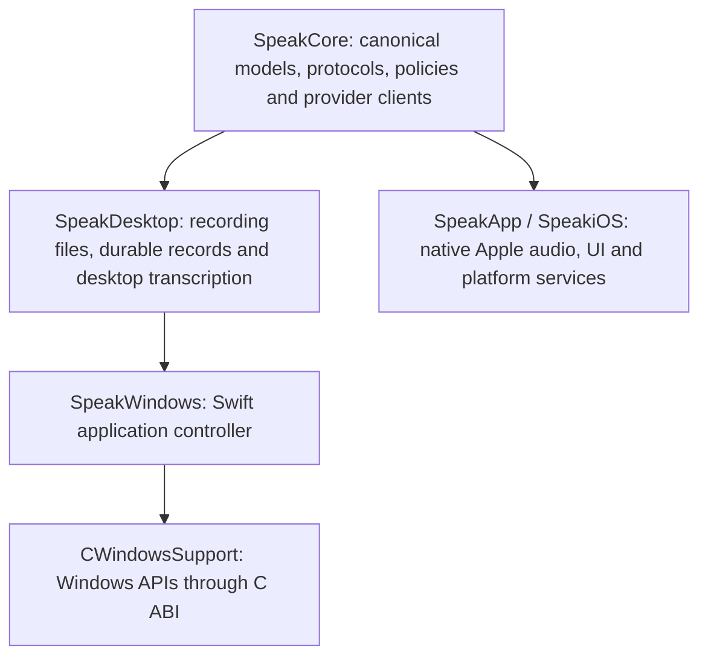

# Windows development and shared Swift core

The Windows target is an **initial native developer build, not a feature-complete
Windows release**. Feature parity with the macOS application remains the product
acceptance criterion. The current implementation does not meet that criterion.
Do not describe a successful build, test run or artifact upload as parity or
shipment.

The implementation keeps Swift for shared behaviour and uses a narrow C ABI to
Windows APIs for the desktop shell, microphone, hotkey, credentials and text
output. Apple audio, UI, local inference and security integrations retain their
native implementations. No web view or separate process is introduced into the
Apple capture path.

## Build and run

Windows CI uses **Swift 6.2.3, Windows Server 2022, x86_64**. Follow the official
[Swift Windows installation guide](https://www.swift.org/install/windows/) for
Visual Studio C++ tools, Windows SDK and Swift prerequisites. That page includes
previous Swift releases; select 6.2.3 to reproduce CI. Windows arm64 is not part
of this target's verified matrix yet.

In PowerShell from the repository root:

```powershell
swift --version
python scripts/verify-portable-core-boundary.py
swift build --configuration release --product SpeakWindows
swift test --configuration release
$bin = swift build --configuration release --show-bin-path
& (Join-Path $bin.Trim() 'SpeakWindows.exe') --self-test
& (Join-Path $bin.Trim() 'SpeakWindows.exe') --ui-smoke-test
& (Join-Path $bin.Trim() 'SpeakWindows.exe')
```

The current source offers microphone recording, audio-file import and **all 31
static remote batch models across seventeen provider families**: OpenAI, Groq,
Deepgram, ElevenLabs, Google Gemini, xAI, Cartesia, Gladia, Speechmatics, Meta,
Azure, Mistral, Soniox, Rev.ai, Modulate, AssemblyAI and OpenRouter. The canonical
shared catalogue owns their identifiers, metadata and routes. OpenRouter model
discovery uses the same cache and refresh policy as Apple; native model controls
refresh without changing an active recording or reusing an earlier model index.
Four OpenAI, three Deepgram, one AssemblyAI, Speechmatics, Soniox, ElevenLabs
and xAI's dedicated speech-to-text live models use shared Swift clients with the native WinHTTP transport. The xAI
stream (`xai/speech-to-text-streaming`, 24 kHz PCM) is source-wired with
fake-transport tests only and still needs a Windows provider receipt; the Grok
Voice conversation route stays unavailable. Batch and Live retain separate model
selections. Native capture is joined before finalisation; received text and audio
survive cancellation or failure, with no automatic insertion on failure.
`Ctrl+Alt+Space` starts and stops recording when registration succeeds. Save the
selected provider's key through the application; each provider uses its canonical
credential identifier in Windows Credential Manager. The app stores settings and
durable recording records under
`%LOCALAPPDATA%\JustSpeakToIt`. A recorded file and pending history record exist
before network transcription starts, so an interrupted request does not discard
the source recording. The microphone selector persists either the Windows default
or an exact endpoint identifier; an unavailable selected device is reported
without silently switching microphones. A coalesced native subscription refreshes
the device list after connections, removals, names and default-device changes.
Snapshots are enumerated off the UI/controller and applied only when idle;
recording keeps its captured device. Missing selected devices retain an
unavailable row and recover their normal label when reconnected. See
[Windows microphone discovery](windows-microphone-discovery.md) for lifecycle,
synthetic checks and remaining hardware acceptance. Transcription and post-processing can be
cancelled while keeping audio and any completed result.

Imports are checked before copying: regular audio files, supported extensions,
non-empty and at most 25 MB. Meta and Azure accept the app's canonical 16 kHz mono PCM16 WAV directly.
Other inputs for those providers use a cancellable in-process Media Foundation
converter, retaining the original in History and removing private temporary WAV
output afterwards. The converter uses installed Windows codecs; it does not
promise support for every Ogg, Opus or WebM encoding. Native Windows decode/cancellation tests passed; run 35725040396 also decoded generated AAC/M4A and MP3 fixtures, checked their non-silent signal and retained originals.
Other compressed formats and physical-device acceptance remain pending. Canonical recordings bypass decoding after a 44-byte header probe. Azure keys accept `key:region` (a raw key defaults to eastus);
custom resource endpoint UI remains pending. Mistral, Soniox and Rev.ai stream multipart bodies
from temporary files, using a native protected ACL for the current Windows user
and SYSTEM. Creation refuses existing files and reparse-point paths; completed,
failed and cancelled uploads remove their staging files. Soniox removes accepted
remote file/job resources after completion, failure and cancellation; a failed
job deletion still attempts file deletion. Rev.ai retains its existing remote-job
retention policy.

The native History pane selects saved recordings, retries batch transcription with
the recording's original model, exports transcript text through an overwrite-
confirming save dialog, and opens retained audio in its registered Windows
application. Live recordings direct users to Batch and Import for retranscription.
Retry and audio actions capture the selected record's identifier. Copy and Export
capture the displayed text and version on the UI thread, before asynchronous
work or the save dialog; a retry replacing the same saved record cannot change
their content. Selection and version events use one worker and one latest pending
value. Text, status and version render together only for the current selection;
changing selection or version clears stale text and disables Copy and Export
until the matching content is displayed. A native search box
filters the rows by original transcript, processed transcript, captured app
profile name or canonical friendly model name. Matching uses Foundation's full case folding and Latin,
Greek and Cyrillic diacritic folding through the shared `SpeakDesktop` policy,
keeps marks that spell words in other scripts, never modifies records or
transcripts, and
rows keep their stable identifiers in newest-first order. Keystrokes coalesce
into one in-flight query, so typing never queues work per keystroke. If the
selected record stops matching, its displayed text and record-bound actions
clear until the search is cleared or another row is chosen. Where a record
retains both transcripts, a Transcript version control switches the displayed
text; it defaults to the processed text, Copy and Export use the version shown
for the captured record, and Retry and Open audio always use the original
recording. Native Play/Pause, Stop and an elapsed/remaining display play the
selected recording in the app: the original file stays pinned read-only and
is decoded by the installed Media Foundation codecs to the output endpoint's
own format, then rendered through event-driven WASAPI; Open audio remains
the explicit external-player action. Playback stops before recording,
importing, switching records or closing, and hardware output remains a
separate acceptance gate. See
[Windows History playback](windows-history-playback.md). History import and
retention controls are not implemented yet.

Post-processing is disabled by default. The native Post-processing dialog can
opt into OpenRouter, choose a shared catalogue model, edit its instructions and
save a separate OpenRouter key in Credential Manager. Apply submits these
settings together. The original transcript is saved before the shared
post-processing client runs; processed text is stored separately. Empty
transcripts remain empty, and a processing failure retains the original and its
failure reason. Local post-processing and live polish are not wired into Windows.

App profiles use the canonical `DictationProfile` data model and ordered matching
policy. The native editor supports add/remove/reorder, full executable paths,
model and language overrides, post-processing mode/model/prompt and output
language. The original executable identity is captured before recording. Its
first matching profile becomes an immutable session snapshot, leaving normal
settings unchanged. Unavailable models, inherited values and Apple-only matchers
survive edits; unsupported overrides have an explicit notice retained in History.
Atomic persistence and queued settings application precede the next recording.
Spoken-language overrides reach supported live models through their shared client:
OpenAI, Deepgram Nova and multilingual Flux. English-only Flux and AssemblyAI
retain a model-specific limitation; Automatic keeps the model's normal language
behaviour without a warning. Personal lexicon overrides are not applied yet.

Automatic insertion targets the control that had focus when the hotkey fired
and re-verifies the captured process, thread, foreground window and focused
control before every delivery. Native Unicode `Edit`/`RichEdit` controls
receive the text directly at the caret or over the selection. Other editable
controls (browser, Electron, XAML, WPF and Office fields) are resolved through
UI Automation on a bounded background worker: an empty field or a fully
selected field is set through the Value pattern, and everything else uses a
guarded clipboard paste that snapshots and restores the previous clipboard
content, excludes the transcript from clipboard history and reads the field
back to confirm the insertion. Password, read-only and disabled fields, a
changed focus or field, and elevated applications fail closed with a Copy
fallback message. Replace-field, direct-only and clipboard-only modes exist
as hand-edited `textOutput` settings without UI yet. See
[Docs/windows-text-insertion.md](windows-text-insertion.md) for the policy,
the deterministic native self-test and the remaining physical acceptance
gates: browser, Electron and Office insertion has synthetic coverage only.

The native-build developer artifact contains an executable, resources and
source/compiler metadata and requires installed Swift 6.2.3 and Visual C++
runtimes. The cross-build workflow also produces a separate
`windows-runtime-bundle` artifact containing an unsigned developer ZIP with the
production executable, resources, authenticated runtime DLLs, licences and
per-file hashes. That ZIP is intended to run after extraction without installing
Swift or an SDK. Its isolated runtime checks must pass for the exact revision
before this can be treated as verified distribution. See
[Windows runtime bundle](windows-runtime-bundle.md) for extraction, provenance,
search-path isolation and the negative controls. Neither artifact is a signed
installer, automatic update or supported Stable Windows release.

### Shared-core checks on other hosts

On macOS, use the Xcode Apple toolchain:

```sh
SPEAK_PORTABLE_CORE=1 xcrun swift test --configuration release
```

The normal Apple build still uses `make build` / `make test` with its established
dependency graph. The environment switch selects the portable graph only; it
also disables Apple-framework capability probes so the same unavailable-model
behaviour can be tested locally.

On Linux, install Swift 6.2.3 using the
[official Linux installation instructions](https://www.swift.org/install/linux/)
and run `swift test --configuration release`. CI uses the official
`swift:6.2.3-jammy` container pinned to its image digest. Linux is a portability
gate for the libraries; this change does not provide a Linux desktop app.

The portable graph has no external Swift package dependencies and may remove
`Package.resolved` while resolving. Preserve the Apple lockfile: restore only
that file from the starting revision after portable validation, provided it had
no unrelated changes before the run. Do not commit its deletion.

The app and complete XCTest executable now **cross-compile from macOS** using a
private, pinned official Swift 6.2.3 toolchain, LLVM 20, Microsoft SDK and MSVC
libraries. The existing Xcode installation and normal Apple build graph stay
unchanged. Follow [the cross-build guide](../scripts/windows-cross/README.md).
The full app workflow copies those exact Mac-built executables to a Windows
runner and verifies their source revision and hashes before execution.
[Release cross-build run 35735185760](https://github.com/crmitchelmore/justspeaktoit/actions/runs/35735185760)
passed at `ac7b5416`: the Mac-built XCTest executable ran **378 tests, 10 optional
skips and zero failures** on Windows, and the production app passed native
self-tests and window smoke checks. The production executable is built and
copied before the separate test-enabled build; metadata verifies
`configuration=release` and `appBuiltForTesting=false`. Its SHA-256 is
`36d633960b12c80b5f3fec2b9aba4183c63ea915a6653723c08cecfc9934fe58`.
The [exact developer artifact](https://github.com/crmitchelmore/justspeaktoit/actions/runs/35735185760/artifacts/10698245839)
is an optimised cross-built app, with the runtime prerequisites described above.

After the model-specific language profiles and dedicated xAI live client were
integrated, the macOS portable suite passed **385 tests, five expected optional
loopback skips and zero failures**. This covers the combined shared source;
native Windows, full Apple and API compatibility checks must also pass for that
revision before it is promoted. It is not a live Windows xAI provider receipt.

At `dc27f528`, the full normal Apple suite passed **3,733 tests, 16 skips and
zero failures**. [Native Windows run 35741471380](https://github.com/crmitchelmore/justspeaktoit/actions/runs/35741471380)
passed **423 tests, ten optional skips and zero failures**, the five independent
WinHTTP probes, and native self/window checks. Its matching
[release cross-build run 35741471399](https://github.com/crmitchelmore/justspeaktoit/actions/runs/35741471399)
also passed. The subsequent Speechmatics integration passed **435 portable
tests, five optional skips and zero failures**; its isolated corrected source
also passed 78 focused Apple tests, including the 25 existing client tests.
Adding the corrected Soniox client brought the combined portable suite to
**466 tests, five optional skips and zero failures**. Its focused normal Apple
gate passed 160 tests. Soniox disconnects, server errors and missing terminal
responses now retain confirmed text for recovery and report failure before
finalisation returns. Physical provider acceptance remains separate.

## Architecture and ownership



| Layer | Current responsibility | Source |
|---|---|---|
| Canonical domain | Model identifiers, provider routes, transcript semantics, Unicode reconciliation, lifecycle ownership, PCM/WAV, comparison and history projections | `Sources/SpeakCore/` |
| Shared batch transport | Seventeen provider routes reuse shared clients, including their HTTP, polling and cancellation behaviour | `Sources/SpeakCore/` provider clients; `Sources/SpeakDesktop/DesktopTranscription.swift` |
| Shared post-processing | Canonical cloud models, cleanup prompts, silence policy and OpenRouter execution | `Sources/SpeakCore/OpenRouterChatClient.swift`, `Sources/SpeakDesktop/DesktopPostProcessing.swift` |
| Desktop behaviour | Implemented-model projection, durable recording records, recovery, export and streaming WAV writes | `Sources/SpeakDesktop/` |
| Windows host | Native-event handling, recording orchestration, settings and credential access | `Sources/SpeakWindows/` |
| Windows services | Event-driven WASAPI capture with a bounded writer queue, native History playback through Media Foundation decoding and event-driven WASAPI rendering, native history/settings UI, hotkey, Credential Manager, clipboard, and captured-field insertion through native controls, UI Automation and a guarded paste | `Sources/CWindowsSupport/` |
| Shared sync | CloudKit record schema, History and Compare Models reconciliation, and the CloudKit Web Services transport for the existing containers | `Sources/SpeakSync/` except `appleSyncSources`; see [Windows CloudKit sync](windows-cloudkit-sync.md) |
| Apple services | Existing SwiftUI, AVFoundation, Speech, Core ML, Keychain, CloudKit and Sparkle integrations | `Sources/SpeakApp/`, `Sources/SpeakiOS/`, native adapters in `Sources/SpeakSync/` |

`Package.swift` selects the portable graph on Windows/Linux and when explicitly
requested on macOS. New `SpeakCore` source files enter the portable build by
default. `appleCoreSources` names the existing Apple-bound dependency closure;
a new exception must be an intentional platform adapter, not a duplicate
implementation of domain behaviour. The boundary check rejects duplicate,
missing or stale exclusions and a return to a portable-source allow-list. Native
Windows/Linux CI then catches accidental Apple framework dependencies.

The catalogue remains canonical. Metadata formerly inside Meta, Cartesia,
Gladia and Speechmatics network implementations now has a shared definition;
existing public client constants forward to it. Adding or retiring a model must
update that definition and its invariants once. Windows' executable model list
is an explicit projection of transports that its application actually wires.
Catalogue membership alone is not a capability claim. In particular, do not use
the Apple on-device fallback when a Windows user's API key is missing.

Future shared policies, provider protocols, request parsing, persistence models
and transcript processing belong in `SpeakCore` or `SpeakDesktop`. Native
capture, resampling, permissions, window behaviour, secure storage, insertion,
local inference acceleration and playback belong behind platform adapters.
Keep PCM and inference in process. Do not route the hot path through JSON RPC,
a web view or disk polling merely to share orchestration.

The macOS host currently executes shared live engines for eleven remote provider
families. This includes xAI's dedicated speech-to-text route and Speechmatics
through `SharedClientLiveController`; a platform-specific client class is not
required for those routes. AssemblyAI, Cartesia, Gladia and Modulate still have
duplicate macOS transports. Deepgram and OpenAI share transport but retain
separate macOS stop orchestration. These are explicit consolidation gaps:
provider changes must still inspect both paths until their adapters are migrated
and their existing capabilities and finalisation behaviour are verified.

WASAPI produces mono PCM16 directly at the selected provider's 16 or 24 kHz
rate in 20 ms frames for Deepgram and 100 ms frames for other routes. A
preallocated, single-producer/single-consumer ring holds at most 640 or 128
frames respectively (12.8 seconds, about 600 KiB at the maximum rate). Its capture-side push performs no heap allocation, mutex
acquisition or disk I/O. A separate writer invokes the Swift file callback;
stop flushes the final partial frame, drains the queue and joins the writer
before closing the recording file. Overflow stops recording with an explicit
error instead of silently dropping frames. These bounds are source guarantees,
not measured latency or microphone-device acceptance.

## Feature parity matrix

“Implemented” below describes source wiring, not completed device acceptance.
The exact CI run and target-device evidence must accompany any promotion in
status. A platform-specific replacement may provide the same user capability,
but must not be presented as the identical Apple-only engine or service.

| Feature | Windows state in this change | Remaining acceptance work |
|---|---|---|
| Recording and file import | WASAPI PCM capture, native controls and file selection implemented | Physical microphones, device changes, permission denial, interruption and long-session recovery |
| Batch transcription | All 31 static remote models through shared clients, plus shared OpenRouter discovery and native refresh | Final-head Windows/Linux CI, real provider receipts and supported formats/languages |
| Live transcription | Four OpenAI, three Deepgram, one AssemblyAI, Speechmatics, Soniox, ElevenLabs and the xAI dedicated speech-to-text model use shared clients and native WinHTTP; Grok Voice is not exposed | Final-head native host checks, Windows provider receipts including real xAI, Speechmatics, Soniox and ElevenLabs streams, and remaining streaming providers |
| Global shortcut | `Ctrl+Alt+Space` registration implemented | Configurable shortcuts, conflicts and press/hold/release parity |
| Text output | Captured-field insertion: native Edit/RichEdit caret/selection replacement, UI Automation Value pattern for empty or fully selected fields, guarded history-excluded paste with clipboard restore and read-back verification, field-identity and password/read-only/elevation refusal; replace-field, direct-only and clipboard-only modes as hand-edited settings | Physical browser/Electron/Office/XAML acceptance, a text output settings UI, undo, streaming insertion and voice edit |
| On-device transcription | Canonical identifiers retained; Apple engines unavailable | Windows local runtime, model download/import/preparation and CPU/GPU performance |
| Post-processing | Opt-in shared OpenRouter execution, canonical model selection and custom prompt; original and processed text retained separately; empty transcripts stay empty | Final-head Windows/Linux CI, real OpenRouter receipts, local execution, live polish and full Apple settings parity |
| Personal vocabulary | Shared correction/lexicon data models compile | Editing UI, correction learning and provider bias integration |
| Profiles and settings | Native ordered per-app editor and shared validation; immutable recording overrides, model-specific live language hints and preserved unknown values | Final-head native UI, physical executable matching, remaining settings and lexicon overrides |
| History | Native record selection, case/diacritic-insensitive search over original/processed text and friendly model names, original/processed transcript selection for copy and export, retry, text export, external audio opening and in-app playback with Play/Pause, Stop and elapsed/remaining through Media Foundation and WASAPI; durable original/processed results and interrupted-recording recovery | Final-head UI smoke and device acceptance, physical speaker/Bluetooth/USB playback, history import and retention controls |
| Model comparison | Shared rounds, scoring and transcript differences compile | Native comparison UI, parallel execution and audio/provider isolation |
| Voice output | Shared catalogues and some request contracts compile; the native playback engine can render decoded audio | Provider execution, wiring synthesized audio onto the native playback engine, system voices and pronunciation controls |
| Hands-free dictation | Domain seams exist; no Windows workflow | Native VAD, pre-roll, endpointing and recovery |
| Credentials | Windows Credential Manager uses canonical identifiers for the seventeen transcription provider families | Physical credential lifecycle acceptance, credential removal UI and remaining providers |
| Sync and Apple companion flows | Portable CloudKit schema, the shared History/Compare Models reconciliation and an injectable CloudKit Web Services transport for the existing containers, with opt-in consent, identity isolation and session-bound retries; source and fixture tests only, no Windows UI, sign-in or host storage | Developer API token and sign-in callback, Windows sign-in, consent and storage, live CloudKit and Mac↔Windows receipts, a CNG envelope provider and portable key sync; Handoff equivalence is unresolved. See [Windows CloudKit sync](windows-cloudkit-sync.md) |
| Automation and integrations | Shared protocol data available in source | Windows CLI/IPC, OpenClaw, deep links and applicable automation surface parity |
| Diagnostics and insights | Shared timing/history/comparison data available | Windows UI, telemetry consent/redaction and end-to-end diagnostic receipts |
| Distribution and updates | Unsigned developer executable artifact | Runtime packaging, signing, installer/uninstaller, upgrade/data migration and update channel |

Apple-specific UI surfaces such as Siri, Live Activities, the iOS keyboard and
Apple Watch are not Windows operating-system APIs. Their relevant user journeys
must be enumerated and either supported through companion protocols or recorded
as explicit product decisions before claiming parity. They are not silently
waived by a successful Swift build.

## Verification and performance thresholds

[The Windows workflow](../.github/workflows/windows.yml) builds the native x64
executable in release configuration, runs shared and Windows adapter tests,
runs `--self-test`, then requires `--ui-smoke-test` to finish within 30 seconds.
It also runs release tests for the portable graph on macOS and
Linux. The actions have read-only repository permissions and require no real
provider keys.

The native self-test checks UTF-8/UTF-16 round trips, invalid encoding, PCM frame
boundaries, silent packets, stop flushing, bounded queue overflow/wrap/FIFO/drain
behaviour, writer failure reporting and rejection of an invalid insertion
target. The text output self-test then drives the insertion adapter against
app-owned hidden Edit/RichEdit controls on a helper thread through injected
foreground, clipboard and keystroke seams: caret and selection insertion,
surrogate pairs, replace-field, stale focus and foreground, password/read-only
refusal on both the native and UI Automation paths, the Value pattern for
empty and fully selected fields, the guarded paste with exact clipboard
restoration, keystroke failure, unverifiable pastes, a clipboard changed by
another application, bounded timeouts, bounded destroy of a blocked worker and
worker cleanup. It never sends real input or touches the system clipboard, and
it is not evidence of insertion into a real browser, Electron or Office
window. The current UI smoke test creates a real native window and checks its
minimum-size control bounds, atomic history replacement, preserved selection,
history action identifiers, search query events with filtered-snapshot
selection clearing and restoration, transcript version defaults with copy and
export version identity, microphone selection snapshots, cancellation, and a
hidden post-processing dialog's atomic Apply callback before shutdown. Profile
smoke checks cover CRUD, ordering, preservation, validation, modal hotkey refusal,
keyboard scrolling and narrow window layout. Model-list smoke checks exercise
refresh, retained selection and transition from batch-only to live-capable lists. Native
storage tests check protected ACLs, existing-file refusal and junction rejection.
The playback self-test drives the production decode, queue and render loop
against a synthetic audio engine without a speaker: exact output bytes with
no trailing silence, source position through pause/resume, cancel and the
final drain, pause before start, event timeout, device failure, immediate
completion, refused second start, callback self-destroy refusal and release
of the pinned source; the window smoke test adds record-bound playback
controls and recording lockout. Hardware playback tests probe the endpoint
explicitly and skip only the audible checks when Windows reports none.
The combined additions passed native CI at `ae61b2e8` and `ac7b5416`, and the
Mac-built release app passed at `ac7b5416`; later revisions require their own checks.
The first playback run at `71be64f2` executed 535 Windows tests with 13 optional
skips and one failure: refusing an oversized source left an input handle pinned.
The reviewed correction retains temporary ownership until validation succeeds;
a regression checks both handle ownership and whether the file can be reopened.
The standalone bundle run also found an empty-environment cleanup failure before
launch. The cleanup now handles absent Swift variables, with an actual PowerShell
regression covering empty and populated environments. Both corrected runtime
paths subsequently passed at `91479ba8`; the receipt is recorded below.
Neither executable smoke test proves physical microphone capture, live provider
transcription, successful external insertion or user-visible feature parity.
Separate adapter unit tests exercise Credential Manager with isolated synthetic
test entries; they do not validate a user's provider credentials.

Verified checkpoints on 22 September 2026:

- [Native Windows/macOS/Linux run 35734154969](https://github.com/crmitchelmore/justspeaktoit/actions/runs/35734154969)
  passed at source `ae61b2e8` (tested merge `c4e8872a`): **378 Windows tests,
  ten optional skips, zero failures**, then all five WinHTTP loopback probes,
  native self-tests and expanded window checks. This includes profiles, dynamic
  model refresh, bounded insertion and microphone hot-plug. The client snapshot
  was inspected: its controls fit without overlap. The
  [developer artifact 10696349821](https://github.com/crmitchelmore/justspeaktoit/actions/runs/35734154969/artifacts/10696349821)
  has executable SHA-256 `a1d475a0b7beedef89cb8d273b0677f1c872a9cfc415501b7dfe9a32eeb98704`.
  Mac and Linux each passed **340 portable tests, five optional skips**.
- [Windows/macOS/Linux run 35729527217](https://github.com/crmitchelmore/justspeaktoit/actions/runs/35729527217)
  passed at source `e20a085e` (tested merge `b2e46fdd`). Windows passed **360
  baseline tests, ten optional probes skipped, zero failures**, then all five
  WinHTTP runtime probes and native/storage/converter/window self-tests.
  [Developer artifact 10695526230](https://github.com/crmitchelmore/justspeaktoit/actions/runs/35729527217/artifacts/10695526230)
  includes source/compiler provenance. This checkpoint contains the shared
  OpenAI/OpenRouter implementations and profiles policy, before the later native
  profile editor, dynamic model controls and expanded insertion adapter.
- [Mac-to-Windows Foundation run 35729527364](https://github.com/crmitchelmore/justspeaktoit/actions/runs/35729527364)
  passed at the same source: the Mac-built Windows executable ran Unicode,
  Array, Codable, Data, URL, regex and atomic file assertions on Windows.
  Its SHA-256 is `05290d2d91fac670d27c688eb23500d939d1fa9c1cb6f99d697d636161e57aed`.
  This is a Foundation runtime receipt, not the full application runtime receipt.
- The full normal Apple `make test` suite at source `5a8decf6` passed **3,652
  tests, sixteen skipped, zero failures**. Focused Apple profile checks at
  `01a06c18` passed **96 tests**. The full Apple run for the combined native profiles,
  dynamic model and insertion checkpoint `0c50d046` passed **3,688 tests, sixteen
  skipped, zero failures**.
- The actual iOS Simulator app compiled and linked at `ac7b5416` with Apple
  Swift 6.2.3, iOS 26.2 and arm64: **zero errors, 74 warnings**, 55.9 seconds.
  This includes the iOS OpenAI adapters and shared OpenRouter code. The build
  used the normal Tuist project with keyboard handoff enabled and signing
  disabled; no simulator launch, device or runtime acceptance is claimed.
- Local combined portable validation passed **339 tests, five optional probes
  skipped, zero failures**; the subsequent profile review regressions passed
  **39 focused tests**. Strict SwiftLint, full Windows Swift host typecheck and
  native C++ warnings-as-errors passed. Host typecheck is supplementary: real
  Microsoft compilation found and fixed COM include and enum-ABI differences.
- A real shared-client `gpt-live-transcribe` probe sent 4.404 seconds of locally
  generated speech and received the expected words without provider errors.
  Readiness was 2,052 ms, first text 3,314 ms and finalisation 532 ms in that
  single macOS probe. These figures are not a Windows or comparative performance
  result. A later silence probe stopped at Keychain access before connecting;
  silence requalification remains unverified.
- [Native run 35732516867](https://github.com/crmitchelmore/justspeaktoit/actions/runs/35732516867)
  and [full app cross-runtime run 35732516925](https://github.com/crmitchelmore/justspeaktoit/actions/runs/35732516925)
  ran the same **376 Windows tests** at `0c50d046`, with one failure in a synthetic
  full-selection insertion case. Its capability probe used a legacy UI Automation
  client instead of the production client; `bbfdb0a8` corrected the probe without
  weakening replacement or clipboard assertions. The later native run above is
  green. The first optimised cross attempt then exposed SwiftPM's release tests
  needing testable imports. `ac7b5416` retains the production app first and builds
  the test-enabled executable separately. Local full release cross-compilation
  and [cross-runtime run 35735185760](https://github.com/crmitchelmore/justspeaktoit/actions/runs/35735185760)
  both passed: **378 Windows tests, ten optional skips, zero failures**, followed
  by native self-tests and window checks on the exact Mac-built release app.
  [Native run 35735185967](https://github.com/crmitchelmore/justspeaktoit/actions/runs/35735185967)
  also passed at the same source, including five independent WinHTTP probes.
- Earlier [run 35725040396](https://github.com/crmitchelmore/justspeaktoit/actions/runs/35725040396)
  verified generated AAC/M4A and MP3 imports through real Media Foundation,
  preserving original files and non-silent decoded samples. It also verified
  Fable's Unicode History search policy on all three platforms.

Provider contract tests use synthetic fixtures and no real provider keys. A
passing suite is not a live provider or physical-device receipt. No current
checkpoint establishes complete parity, clean-machine installation or measured
performance equivalence.

Record Windows CI and physical acceptance receipts separately, with commit,
executable hash, OS/architecture, device, input fixture, provider/model and
observed result. Consult the current workflow run for the current revision.

Before Windows feature acceptance, prove a physical microphone → provider →
transcript → intended external field journey and its cancellation/failure paths.
Before a Windows release, prove installation, launch, upgrade, retained data and
uninstallation on a clean supported Windows machine with no development tools.
An uploaded executable does not satisfy that gate.

Performance acceptance requires measurements, not a claim inferred from native
code. Preserve the same input audio and provider conditions when comparing:

- Cold/warm start to first captured audio, first partial and completed insertion;
  report distributions, including p50 and p95.
- CPU, peak memory and retained audio buffers during capture and long sessions;
  verify capture and network backpressure remain bounded.
- Stop/finalisation latency and exact retained audio/transcript contents.
- Local inference throughput, cold load and memory on supported CPU/GPU paths.
- The macOS baseline before and after shared-core refactors, with its existing
  native acceleration retained.

Record and investigate regressions before broadening availability. Shared code
is accepted only when its consumers retain correct behaviour and measured
performance on their own platforms.

The combined shared-provider and framing checkpoint passed **509 portable release
tests, five optional skips, zero failures** on 22 September 2026. It includes
ElevenLabs manual commit ordering, Soniox finalisation budgets and desktop route
projection. Soniox's macOS adapter now delegates transport and finalisation to
the same shared client while preserving native capture. Failed or cancelled
finalisation keeps visible draft text separate from provider-confirmed text.

Deepgram capture uses 20 ms Windows frames; other routes keep 100 ms. Synthetic
10/20 ms packet tests at both supported rates show first delivery at 20 ms instead
of 100 ms, preserving exact sample order and final tails. The queue retains its
12.8-second bound and 600 KiB PCM storage. This isolates application batching; it
is not a physical-device or end-to-end latency measurement.

At `9e4ac674`, the complete normal Apple `make test` suite passed **3,889
tests, 16 optional skips, zero failures**. Both macOS Soniox and ElevenLabs
controllers now use shared protocol clients while retaining native audio
capture. Their recovery adapters preserve visible drafts separately from
provider-confirmed text. The ElevenLabs outer stop watchdog captures its
shared drain bound plus the run's bounded grace and a callback-delivery margin;
healthy completion does not wait for that deadline. Deterministic tests cover
late finals, specific failures and retired timers across replacement recordings.

The subsequent integrated recovery checkpoint `d6c4bb47` passed the full normal
Apple suite: **3,900 tests, 16 optional skips, zero failures**. Strict baseline
lint passed across 1,272 files. The generic macOS host now captures provider
errors before the UI hop, preserves trailing drafts on failed finalisation,
aborts cancellation and suppresses terminal success or utterance dispatch after
reentrant cancellation. Its eleven new regressions run against the actual
controller with injected capture/client boundaries; the PCM path is unchanged.

The iOS shared host received the same recovery guarantees and reads the active
client's optional finalisation budget. **Thirty-three focused iOS Simulator
tests passed with no failures or skips**, including all nine interruption
fixtures. The old controller failed the draft-preservation and abort-contract
comparison cases. The production app compiled and linked; isolated fixtures
use existing injected services rather than constructing live CloudKit state.
The integrated portable suite passed 511 tests with five optional skips and
zero failures. These checks do not qualify physical audio or the later branch's
Windows runtime; use the exact Windows checkpoint below for that evidence.

The shared ElevenLabs client streams partials continuously and confirms
client-owned segments of at most twenty seconds. This changes the former macOS
server-VAD confirmation cadence; real-provider transcript behaviour and latency
require qualification before release. The portable and Apple unit suites do not
substitute for that acceptance check.

The subsequent History correction `ca4b85c4` passed **3,903 normal Apple tests**
(16 optional skips), **514 portable release tests** (five optional skips), and
strict baseline lint across 1,274 files, all with zero failures or violations.
A deterministic delayed-event test failed before the correction; eighteen
focused History/dispatch tests, real Microsoft SDK syntax checking and the
optimised Windows cross-link passed after it. The native smoke test now exercises
the actual delayed-selection, version, row-refresh and displayed-text snapshot
paths. Its runtime receipt must come from Windows CI for the corresponding
source revision; the earlier checkpoint below predates this correction.

Verified Windows checkpoint `5aab9c5e` (22 September 2026):

- [Native Windows run 35753297954](https://github.com/crmitchelmore/justspeaktoit/actions/runs/35753297954)
  passed **580 tests, 13 optional skips, zero failures**, then all five WinHTTP
  loopback probes and native executable/window checks.
- [Mac cross-build and Windows execution run 35753297969](https://github.com/crmitchelmore/justspeaktoit/actions/runs/35753297969)
  passed **580 tests, 13 optional skips, zero failures** from the exact Mac-built
  release test executable. The production executable also passed playback,
  native/window and isolated runtime-bundle checks. Both runs tested PR merge
  `386ddeb5bbb5538c1f46cec28df343d989870e8b`; its source tree is identical to
  `5aab9c5e`.
- The [runtime bundle artifact](https://github.com/crmitchelmore/justspeaktoit/actions/runs/35753297969/artifacts/10706219200)
  contains a 30-file developer ZIP with 17 runtime DLLs. In all three isolated
  runs, the application and all 17 DLLs loaded from the extracted bundle with
  no foreign modules or missing static imports. Swift was absent from PATH,
  the working directory was empty, and the bundle path contained spaces and
  Greek characters. Removing the DLLs produced `STATUS_DLL_NOT_FOUND`; removing
  the real application resource produced exit 1.
- ZIP SHA-256: `2e92ec9c2e95ec891cc17ad22b79e6d5e00f88394d4dc01e50f64eb5cedf3316`.
  The three native/cross/bundle window screenshots were byte-identical and
  inspected for control bounds. These tests use synthetic content. The hosted
  runner had no physical output endpoint, so three audible playback cases were
  explicitly skipped; microphone, speaker/Bluetooth/USB and external-app
  insertion acceptance remain open.
