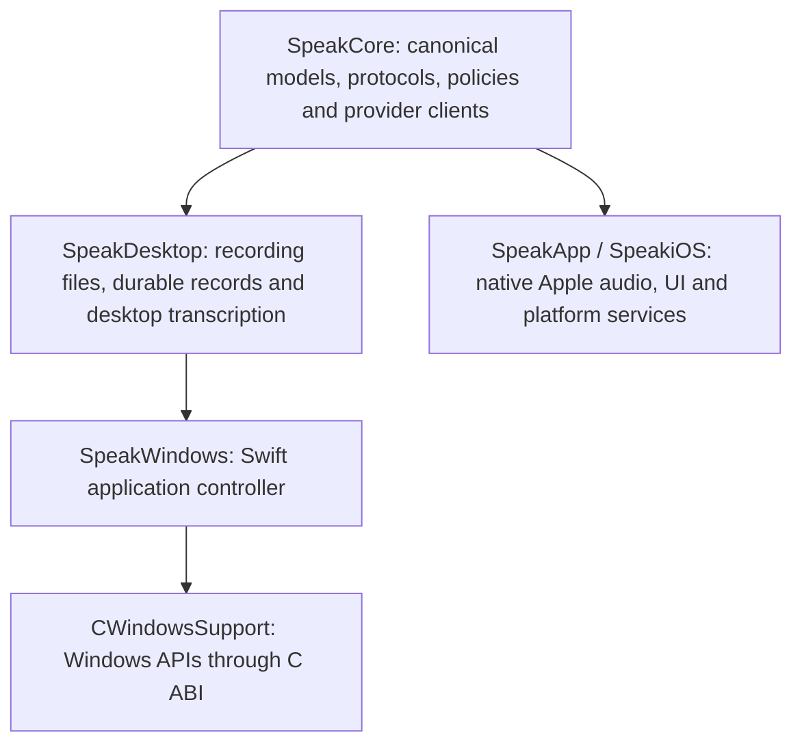

# Windows development and shared Swift core

The Windows target is an **initial native developer build, not a feature-complete
Windows release**. Feature parity with the macOS application remains the product
acceptance criterion. The current implementation does not meet that criterion.
Do not describe a successful build, test run or artifact upload as parity or
shipment.

The implementation keeps Swift for shared behaviour and uses a narrow C ABI to
Windows APIs for the desktop shell, microphone, hotkey, credentials and text
output. Apple audio, UI, local inference and security integrations retain their
native implementations. No web view or separate process is introduced into the
Apple capture path.

## Build and run

Windows CI uses **Swift 6.2.3, Windows Server 2022, x86_64**. Follow the official
[Swift Windows installation guide](https://www.swift.org/install/windows/) for
Visual Studio C++ tools, Windows SDK and Swift prerequisites. That page includes
previous Swift releases; select 6.2.3 to reproduce CI. Windows arm64 is not part
of this target's verified matrix yet.

In PowerShell from the repository root:

```powershell
swift --version
python scripts/verify-portable-core-boundary.py
swift build --configuration release --product SpeakWindows
swift test --configuration release
$bin = swift build --configuration release --show-bin-path
& (Join-Path $bin.Trim() 'SpeakWindows.exe') --self-test
& (Join-Path $bin.Trim() 'SpeakWindows.exe') --ui-smoke-test
& (Join-Path $bin.Trim() 'SpeakWindows.exe')
```

The current source offers microphone recording, audio-file import and **28 batch
models across sixteen providers**: OpenAI, Groq, Deepgram, ElevenLabs, Google Gemini,
xAI, Cartesia, Gladia, Speechmatics, Meta, Azure, Mistral, Soniox, Rev.ai, Modulate and AssemblyAI. These are projections of the canonical
shared catalogue and execute through shared provider clients. Three Deepgram live models and AssemblyAI Universal-3.5 Pro are wired through shared Swift session snapshots and the native WinHTTP
adapter, whose five Windows runtime probes passed. Windows host integration
passed at `6fcb528d`; real provider acceptance remains pending. Batch and Live keep separate
model selections. Native capture is joined before finalisation; received text
and audio survive cancellation or failure, with no automatic insertion on failure.
`Ctrl+Alt+Space` starts and stops recording when registration succeeds. Save the
selected provider's key through the application; each provider uses its canonical
credential identifier in Windows Credential Manager. The app stores settings and
durable recording records under
`%LOCALAPPDATA%\JustSpeakToIt`. A recorded file and pending history record exist
before network transcription starts, so an interrupted request does not discard
the source recording. The microphone selector persists either the Windows default
or an exact endpoint identifier; an unavailable selected device is reported
without silently switching microphones. The device list refreshes at launch;
hot-plug refresh is still pending. Transcription and post-processing can be
cancelled while keeping audio and any completed result.

Imports are checked before copying: regular audio files, supported extensions,
non-empty and at most 25 MB. Meta and Azure accept the app's canonical 16 kHz mono PCM16 WAV directly.
Other inputs for those providers use a cancellable in-process Media Foundation
converter, retaining the original in History and removing private temporary WAV
output afterwards. The converter uses installed Windows codecs; it does not
promise support for every Ogg, Opus or WebM encoding. Native Windows decode/cancellation tests passed; run 35725040396 also decoded generated AAC/M4A and MP3 fixtures, checked their non-silent signal and retained originals.
Other compressed formats and physical-device acceptance remain pending. Canonical recordings bypass decoding after a 44-byte header probe. Azure keys accept `key:region` (a raw key defaults to eastus);
custom resource endpoint UI remains pending. Mistral, Soniox and Rev.ai stream multipart bodies
from temporary files, using a native protected ACL for the current Windows user
and SYSTEM. Creation refuses existing files and reparse-point paths; completed,
failed and cancelled uploads remove their staging files. Soniox removes accepted
remote file/job resources after completion, failure and cancellation; a failed
job deletion still attempts file deletion. Rev.ai retains its existing remote-job
retention policy.

The native History pane selects saved recordings, retries transcription with
the recording's original model, exports transcript text through an overwrite-
confirming save dialog, and opens retained audio in its registered Windows
application. Copy, retry, export and audio actions capture the selected record's
identifier so later selection changes cannot redirect them. A native search box
filters the rows by original transcript, processed transcript or canonical
friendly model name. Matching uses Foundation's full case folding and Latin,
Greek and Cyrillic diacritic folding through the shared `SpeakDesktop` policy,
keeps marks that spell words in other scripts, never modifies records or
transcripts, and
rows keep their stable identifiers in newest-first order. Keystrokes coalesce
into one in-flight query, so typing never queues work per keystroke. If the
selected record stops matching, its displayed text and record-bound actions
clear until the search is cleared or another row is chosen. Where a record
retains both transcripts, a Transcript version control switches the displayed
text; it defaults to the processed text, Copy and Export use the version shown
for the captured record, and Retry and Open audio always use the original
recording. Embedded playback, history import and retention controls are not
implemented yet.

Post-processing is disabled by default. The native Post-processing dialog can
opt into OpenRouter, choose a shared catalogue model, edit its instructions and
save a separate OpenRouter key in Credential Manager. Apply submits these
settings together. The original transcript is saved before the shared
post-processing client runs; processed text is stored separately. Empty
transcripts remain empty, and a processing failure retains the original and its
failure reason. Local post-processing and live polish are not wired into Windows.

Automatic insertion currently supports focused native Unicode `Edit` and
`RichEdit` controls. It verifies the originally captured process, thread, window
and focused control before replacement. Other controls, a changed focus or a
password/read-only field result in a copy fallback message. Broad browser,
Electron, Office and elevated-app insertion parity is not implemented.

The uploaded artifact contains a developer executable, resource directories,
source/compiler metadata and an executable SHA-256 digest. It requires the
installed Swift 6.2.3 Windows runtime and Visual C++ runtime. It is **not** a
standalone installer, signed release, automatic update or supported stable
Windows distribution.

### Shared-core checks on other hosts

On macOS, use the Xcode Apple toolchain:

```sh
SPEAK_PORTABLE_CORE=1 xcrun swift test --configuration release
```

The normal Apple build still uses `make build` / `make test` with its established
dependency graph. The environment switch selects the portable graph only; it
also disables Apple-framework capability probes so the same unavailable-model
behaviour can be tested locally.

On Linux, install Swift 6.2.3 using the
[official Linux installation instructions](https://www.swift.org/install/linux/)
and run `swift test --configuration release`. CI uses the official
`swift:6.2.3-jammy` container pinned to its image digest. Linux is a portability
gate for the libraries; this change does not provide a Linux desktop app.

The portable graph has no external Swift package dependencies and may remove
`Package.resolved` while resolving. Preserve the Apple lockfile: restore only
that file from the starting revision after portable validation, provided it had
no unrelated changes before the run. Do not commit its deletion.

**Cross-compiling a Windows executable from macOS has not been verified.**
Native compilation on Windows is the current build path. The official Swift
Windows installer establishes that Windows is a supported Swift host; it does
not prove this repository can cross-compile from macOS. Any future cross-build
must produce an artifact that passes the same tests on a real Windows host.

## Architecture and ownership



| Layer | Current responsibility | Source |
|---|---|---|
| Canonical domain | Model identifiers, provider routes, transcript semantics, Unicode reconciliation, lifecycle ownership, PCM/WAV, comparison and history projections | `Sources/SpeakCore/` |
| Shared batch transport | Sixteen provider routes reuse shared clients, including their HTTP, polling and cancellation behaviour | `Sources/SpeakCore/` provider clients; `Sources/SpeakDesktop/DesktopTranscription.swift` |
| Shared post-processing | Canonical cloud models, cleanup prompts, silence policy and OpenRouter execution | `Sources/SpeakCore/OpenRouterChatClient.swift`, `Sources/SpeakDesktop/DesktopPostProcessing.swift` |
| Desktop behaviour | Implemented-model projection, durable recording records, recovery, export and streaming WAV writes | `Sources/SpeakDesktop/` |
| Windows host | Native-event handling, recording orchestration, settings and credential access | `Sources/SpeakWindows/` |
| Windows services | Event-driven WASAPI capture with a bounded writer queue, native history/settings UI, hotkey, Credential Manager, clipboard and guarded native-control insertion | `Sources/CWindowsSupport/` |
| Apple services | Existing SwiftUI, AVFoundation, Speech, Core ML, Keychain, CloudKit and Sparkle integrations | `Sources/SpeakApp/`, `Sources/SpeakiOS/`, `Sources/SpeakSync/` |

`Package.swift` selects the portable graph on Windows/Linux and when explicitly
requested on macOS. New `SpeakCore` source files enter the portable build by
default. `appleCoreSources` names the existing Apple-bound dependency closure;
a new exception must be an intentional platform adapter, not a duplicate
implementation of domain behaviour. The boundary check rejects duplicate,
missing or stale exclusions and a return to a portable-source allow-list. Native
Windows/Linux CI then catches accidental Apple framework dependencies.

The catalogue remains canonical. Metadata formerly inside Meta, Cartesia,
Gladia and Speechmatics network implementations now has a shared definition;
existing public client constants forward to it. Adding or retiring a model must
update that definition and its invariants once. Windows' executable model list
is an explicit projection of transports that its application actually wires.
Catalogue membership alone is not a capability claim. In particular, do not use
the Apple on-device fallback when a Windows user's API key is missing.

Future shared policies, provider protocols, request parsing, persistence models
and transcript processing belong in `SpeakCore` or `SpeakDesktop`. Native
capture, resampling, permissions, window behaviour, secure storage, insertion,
local inference acceleration and playback belong behind platform adapters.
Keep PCM and inference in process. Do not route the hot path through JSON RPC,
a web view or disk polling merely to share orchestration.

WASAPI produces mono PCM16 directly at the selected provider's 16 or 24 kHz
rate in 100 ms frames. A preallocated, single-producer/single-consumer ring holds
at most 128 frames (12.8 seconds, about 600 KiB at the maximum rate). Its capture-side push performs no heap allocation, mutex
acquisition or disk I/O. A separate writer invokes the Swift file callback;
stop flushes the final partial frame, drains the queue and joins the writer
before closing the recording file. Overflow stops recording with an explicit
error instead of silently dropping frames. These bounds are source guarantees,
not measured latency or microphone-device acceptance.

## Feature parity matrix

“Implemented” below describes source wiring, not completed device acceptance.
The exact CI run and target-device evidence must accompany any promotion in
status. A platform-specific replacement may provide the same user capability,
but must not be presented as the identical Apple-only engine or service.

| Feature | Windows state in this change | Remaining acceptance work |
|---|---|---|
| Recording and file import | WASAPI PCM capture, native controls and file selection implemented | Physical microphones, device changes, permission denial, interruption and long-session recovery |
| Batch transcription | 28 canonical models across OpenAI, Groq, Deepgram, ElevenLabs, Google Gemini, xAI, Cartesia, Gladia, Speechmatics, Meta, Azure, Mistral, Soniox, Rev.ai, Modulate and AssemblyAI, through shared clients | Final-head Windows/Linux CI, real provider receipts, supported formats/languages and remaining macOS providers |
| Live transcription | Deepgram and AssemblyAI routes use shared sessions and a runtime-qualified native WinHTTP transport | Final-head native host checks, real provider receipts and remaining streaming providers |
| Global shortcut | `Ctrl+Alt+Space` registration implemented | Configurable shortcuts, conflicts and press/hold/release parity |
| Text output | Captured native Edit/RichEdit insertion and explicit copy implemented | Browser/Electron/Office coverage, selections, undo, streaming insertion and voice edit |
| On-device transcription | Canonical identifiers retained; Apple engines unavailable | Windows local runtime, model download/import/preparation and CPU/GPU performance |
| Post-processing | Opt-in shared OpenRouter execution, canonical model selection and custom prompt; original and processed text retained separately; empty transcripts stay empty | Final-head Windows/Linux CI, real OpenRouter receipts, local execution, live polish and full Apple settings parity |
| Personal vocabulary | Shared correction/lexicon data models compile | Editing UI, correction learning and provider bias integration |
| Profiles and settings | Shared profile models; basic Windows model persistence | Full settings, per-application profiles and migration |
| History | Native record selection, case/diacritic-insensitive search over original/processed text and friendly model names, original/processed transcript selection for copy and export, retry, text export and external audio opening; durable original/processed results and interrupted-recording recovery | Final-head UI smoke and device acceptance, embedded playback, history import and retention controls |
| Model comparison | Shared rounds, scoring and transcript differences compile | Native comparison UI, parallel execution and audio/provider isolation |
| Voice output | Shared catalogues and some request contracts compile | Provider execution, native playback, system voices and pronunciation controls |
| Hands-free dictation | Domain seams exist; no Windows workflow | Native VAD, pre-roll, endpointing and recovery |
| Credentials | Windows Credential Manager uses canonical identifiers for the sixteen transcription providers and OpenRouter | Physical credential lifecycle acceptance, credential removal UI and remaining providers |
| Sync and Apple companion flows | No Windows sync implementation | Explicit interoperable protocol and consent design; CloudKit/Handoff equivalence is unresolved |
| Automation and integrations | Shared protocol data available in source | Windows CLI/IPC, OpenClaw, deep links and applicable automation surface parity |
| Diagnostics and insights | Shared timing/history/comparison data available | Windows UI, telemetry consent/redaction and end-to-end diagnostic receipts |
| Distribution and updates | Unsigned developer executable artifact | Runtime packaging, signing, installer/uninstaller, upgrade/data migration and update channel |

Apple-specific UI surfaces such as Siri, Live Activities, the iOS keyboard and
Apple Watch are not Windows operating-system APIs. Their relevant user journeys
must be enumerated and either supported through companion protocols or recorded
as explicit product decisions before claiming parity. They are not silently
waived by a successful Swift build.

## Verification and performance thresholds

[The Windows workflow](../.github/workflows/windows.yml) builds the native x64
executable in release configuration, runs shared and Windows adapter tests,
runs `--self-test`, then requires `--ui-smoke-test` to finish within 30 seconds.
It also runs release tests for the portable graph on macOS and
Linux. The actions have read-only repository permissions and require no real
provider keys.

The native self-test checks UTF-8/UTF-16 round trips, invalid encoding, PCM frame
boundaries, silent packets, stop flushing, bounded queue overflow/wrap/FIFO/drain
behaviour, writer failure reporting and rejection of an invalid insertion
target. The current UI smoke test creates a real native window and checks its
minimum-size control bounds, atomic history replacement, preserved selection,
history action identifiers, search query events with filtered-snapshot
selection clearing and restoration, transcript version defaults with copy and
export version identity, microphone selection snapshots, cancellation, and a
hidden post-processing dialog's atomic Apply callback before shutdown. Native
storage tests check protected ACLs, existing-file refusal and junction rejection.
The microphone/cancellation/storage/search/transcript-version additions still
require final-head CI.
Neither executable smoke test proves physical microphone capture, live provider
transcription, successful external insertion or user-visible feature parity.
Separate adapter unit tests exercise Credential Manager with isolated synthetic
test entries; they do not validate a user's provider credentials.

Verified baseline on 22 September 2026:

- The full Apple `make test` run at the initial extraction completed **3,434
  tests, 16 skipped, zero failures**. This is regression evidence for that
  extraction, not a performance measurement or a later-head test result.
- [Windows and Portable Swift run 35710382001](https://github.com/crmitchelmore/justspeaktoit/actions/runs/35710382001)
  at commit `317ae843d59755f31d4ca911bef8f23a019a9752` passed native Windows x64
  release compilation, **26 tests**, executable self-test and native window
  creation/shutdown. Its macOS and Linux portable jobs also passed.
- That run produced [developer artifact 10686856024](https://github.com/crmitchelmore/justspeaktoit/actions/runs/35710382001/artifacts/10686856024),
  with source/compiler provenance. It is the initial OpenAI-only build;
  it does not contain the later four-provider expansion.
- [Windows and Portable Swift run 35712163693](https://github.com/crmitchelmore/justspeaktoit/actions/runs/35712163693)
  passed Windows x64 release compilation, **36 tests with zero failures**, the
  native adapter/queue self-test and basic window creation/shutdown. Its macOS
  and Linux portable jobs also passed. The source head was
  `b9ed4cf0ca6098469a970580333d4a46d0c6ece4`; the PR workflow checked out and
  built merge commit `2ded43f35129842e9a9b9f03083a907f46c8fb48` containing that
  source. This distinction is recorded in the artifact's source provenance.
- That run produced [developer artifact 10687273137](https://github.com/crmitchelmore/justspeaktoit/actions/runs/35712163693/artifacts/10687273137).
  It predates the current native History pane, nine-provider expansion and
  OpenRouter post-processing. Its green status does not verify those changes
  or their expanded UI smoke checks.
- [Run 35715629357](https://github.com/crmitchelmore/justspeaktoit/actions/runs/35715629357)
  at source `e5187211` (tested merge `3128c2e6`) passed Windows release build,
  **69 baseline tests, five optional probes skipped, zero failures**, and the
  expanded native history/settings window checks. Portable macOS/Linux passed.
  [Developer artifact 10689515020](https://github.com/crmitchelmore/justspeaktoit/actions/runs/35715629357/artifacts/10689515020)
  contains the nine-provider implementation. Its overall workflow is **failed**:
  the separate Windows FoundationNetworking WebSocket probe found missing pong
  completion and partial-message delivery for a 2 MiB server echo. Handshake,
  PCM exchange, cancellation and abrupt-disconnect checks worked. This evidence
  requires a Windows transport adapter before any live model is exposed.
- The full Apple suite after the nine-provider extraction passed **3,476 tests,
  16 skipped, zero failures**. Later changes require their own regression checks.
- [Run 35718564307](https://github.com/crmitchelmore/justspeaktoit/actions/runs/35718564307)
  at source `bd8b4235` (tested merge `ad89d515`) passed the Windows release build,
  **125 baseline tests, ten optional probes skipped, zero failures**, followed by
  **all five native WinHTTP runtime probes with zero skips or failures**. These
  cover handshake, 100 ms PCM, server ping/autopong, close status/reason, cancelled
  handshake/receive, abrupt disconnect, fragmented Unicode/binary messages, two
  exact 2 MiB echoes and oversized-message rejection. Portable macOS/Linux passed.
  The overall run failed in executable self-test on private staging ownership;
  this run therefore does not qualify the expanded native window or host.
- [Run 35721370500](https://github.com/crmitchelmore/justspeaktoit/actions/runs/35721370500)
  built source `1e4b2f7a` on Windows and passed all five native Swift/conversion
  tests: 48 kHz stereo to canonical PCM, source preservation, pre-cancellation,
  cancellation during decoding/completion, invalid input cleanup and existing
  output protection. The overall run failed only a Modulate test header-case
  assumption, also caught on Linux; `b54d5170` fixes that assertion. The native
  executable self-test and window smoke were skipped after this test failure.
- The full Apple `make test` suite at pushed source `1e4b2f7a` passed **3,577
  tests, 16 skipped, zero failures**. This includes the Modulate and AssemblyAI
  extractions and the shared live error/finalisation ordering fix.
- [Run 35722016248](https://github.com/crmitchelmore/justspeaktoit/actions/runs/35722016248)
  is green for source `b54d5170` (tested merge `14ea6c3a`). Windows passed
  **206 baseline tests, ten optional probes skipped, zero failures**, then all
  **five WinHTTP runtime probes**, executable native/storage/decoder self-tests
  and the expanded native window checks. Portable macOS/Linux passed.
  [Developer artifact 10692237189](https://github.com/crmitchelmore/justspeaktoit/actions/runs/35722016248/artifacts/10692237189)
  contains the executable and compiler/source metadata. Executable SHA-256:
  `81F728109F8DCE62D3A841942A5BE9D0B6482BDBCD5FFC593073CC984C625705`.
  Its native UI snapshot was inspected; controls fit and the corrected snapshot
  origin shows the complete client area. This receipt precedes 24 kHz capture.
- The subsequent direct 16/24 kHz native capture implementation and expanded
  self-tests were authored by Claude Fable 5.1 at `max`, session
  `8bef4c77-0e20-4453-a9d3-9a9af8757bfc`. Integrated source `6fcb528d` passed
  [run 35722960563](https://github.com/crmitchelmore/justspeaktoit/actions/runs/35722960563)
  on Windows, macOS and Linux, including native capture self-tests and window
  checks. Physical microphone acceptance remains pending.
- Fable-authored History search and transcript-version selection were integrated
  as `38867775`. Local portable validation passed **186 tests, five skipped,
  zero failures**, plus strict SwiftLint, native C++ warnings-as-errors and the
  Windows Swift host typecheck. Its
  [native run 35723903725](https://github.com/crmitchelmore/justspeaktoit/actions/runs/35723903725)
  is green on Windows, macOS and Linux. The native window smoke verified search
  events, filtered selection, transcript variants, record-bound actions and
  control bounds; its captured window was visually inspected. This is not a
  physical History acceptance receipt. A subsequent Fable fix uses Foundation
  Unicode folding to match German sharp s and Greek sigma without stripping
  meaningful Devanagari, Thai or Arabic marks. That policy passed on Windows,
  macOS and Linux in source `99b2ccfa`,
  [run 35725040396](https://github.com/crmitchelmore/justspeaktoit/actions/runs/35725040396),
  along with real AAC/M4A and MP3 import decoding, the transport probes and
  native self-tests. Source fixtures contain generated tones only.
- Fable's subsequent History recovery fix validates metadata filename/record
  identity and rejects unsafe audio paths before header repair. Invalid records
  cannot redirect repair outside History or replace another record's metadata.
  The integrated local suite passed **192 tests, five skipped, zero failures**;
  this later revision's native CI is pending. Native handle protection against
  concurrent file replacement/hard links remains separate from these path checks.
- **Final-head Windows, macOS and Linux CI for the current source is pending.**
  Provider contract tests use the shared URLProtocol stub and no live provider
  keys; test success must not be reported as a live transcription receipt.

Record Windows CI and physical acceptance receipts separately, with commit,
executable hash, OS/architecture, device, input fixture, provider/model and
observed result. Consult the current workflow run for the current revision.

Before Windows feature acceptance, prove a physical microphone → provider →
transcript → intended external field journey and its cancellation/failure paths.
Before a Windows release, prove installation, launch, upgrade, retained data and
uninstallation on a clean supported Windows machine with no development tools.
An uploaded executable does not satisfy that gate.

Performance acceptance requires measurements, not a claim inferred from native
code. Preserve the same input audio and provider conditions when comparing:

- Cold/warm start to first captured audio, first partial and completed insertion;
  report distributions, including p50 and p95.
- CPU, peak memory and retained audio buffers during capture and long sessions;
  verify capture and network backpressure remain bounded.
- Stop/finalisation latency and exact retained audio/transcript contents.
- Local inference throughput, cold load and memory on supported CPU/GPU paths.
- The macOS baseline before and after shared-core refactors, with its existing
  native acceleration retained.

Record and investigate regressions before broadening availability. Shared code
is accepted only when its consumers retain correct behaviour and measured
performance on their own platforms.
