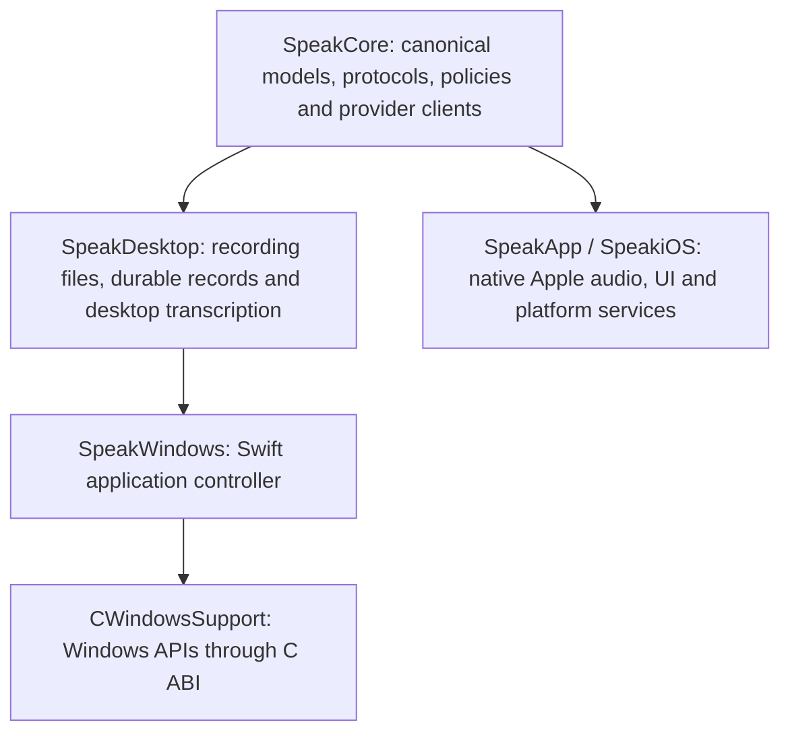

# Windows development and shared Swift core

The Windows target is an **initial native developer build, not a feature-complete
Windows release**. Feature parity with the macOS application remains the product
acceptance criterion. The current implementation does not meet that criterion.
Do not describe a successful build, test run or artifact upload as parity or
shipment.

The implementation keeps Swift for shared behaviour and uses a narrow C ABI to
Windows APIs for the desktop shell, microphone, hotkey, credentials and text
output. Apple audio, UI, local inference and security integrations retain their
native implementations. No web view or separate process is introduced into the
Apple capture path.

## Build and run

Windows CI uses **Swift 6.2.3, Windows Server 2022, x86_64**. Follow the official
[Swift Windows installation guide](https://www.swift.org/install/windows/) for
Visual Studio C++ tools, Windows SDK and Swift prerequisites. That page includes
previous Swift releases; select 6.2.3 to reproduce CI. Windows arm64 is not part
of this target's verified matrix yet.

In PowerShell from the repository root:

```powershell
swift --version
python scripts/verify-portable-core-boundary.py
swift build --configuration release --product SpeakWindows
swift test --configuration release
$bin = swift build --configuration release --show-bin-path
& (Join-Path $bin.Trim() 'SpeakWindows.exe') --self-test
& (Join-Path $bin.Trim() 'SpeakWindows.exe') --ui-smoke-test
& (Join-Path $bin.Trim() 'SpeakWindows.exe')
```

The application offers microphone recording, audio-file import and batch models
from OpenAI, Cartesia, Gladia and Speechmatics. These are projections of the
canonical shared catalogue; other providers and live models remain unavailable.
`Ctrl+Alt+Space` starts and stops recording when registration succeeds. Save the
selected provider's key through the application; each provider uses its canonical
credential identifier in Windows Credential Manager. The app stores settings and durable recording records under
`%LOCALAPPDATA%\JustSpeakToIt`. A recorded file and pending history record exist
before network transcription starts, so an interrupted request does not discard
the source recording.

Automatic insertion currently supports focused native Unicode `Edit` and
`RichEdit` controls. It verifies the originally captured process, thread, window
and focused control before replacement. Other controls, a changed focus or a
password/read-only field result in a copy fallback message. Broad browser,
Electron, Office and elevated-app insertion parity is not implemented.

The uploaded artifact contains a developer executable, resource directories,
source/compiler metadata and an executable SHA-256 digest. It requires the
installed Swift 6.2.3 Windows runtime and Visual C++ runtime. It is **not** a
standalone installer, signed release, automatic update or supported stable
Windows distribution.

### Shared-core checks on other hosts

On macOS, use the Xcode Apple toolchain:

```sh
SPEAK_PORTABLE_CORE=1 xcrun swift test --configuration release
```

The normal Apple build still uses `make build` / `make test` with its established
dependency graph. The environment switch selects the portable graph only; it
also disables Apple-framework capability probes so the same unavailable-model
behaviour can be tested locally.

On Linux, install Swift 6.2.3 using the
[official Linux installation instructions](https://www.swift.org/install/linux/)
and run `swift test --configuration release`. CI uses the official
`swift:6.2.3-jammy` container pinned to its image digest. Linux is a portability
gate for the libraries; this change does not provide a Linux desktop app.

The portable graph has no external Swift package dependencies and may remove
`Package.resolved` while resolving. Preserve the Apple lockfile: restore only
that file from the starting revision after portable validation, provided it had
no unrelated changes before the run. Do not commit its deletion.

**Cross-compiling a Windows executable from macOS has not been verified.**
Native compilation on Windows is the current build path. The official Swift
Windows installer establishes that Windows is a supported Swift host; it does
not prove this repository can cross-compile from macOS. Any future cross-build
must produce an artifact that passes the same tests on a real Windows host.

## Architecture and ownership



| Layer | Current responsibility | Source |
|---|---|---|
| Canonical domain | Model identifiers, provider routes, transcript semantics, Unicode reconciliation, lifecycle ownership, PCM/WAV, comparison and history projections | `Sources/SpeakCore/` |
| Shared batch transport | Direct OpenAI transcription plus the existing Cartesia, Gladia and Speechmatics clients; no copied HTTP, polling or cancellation logic | `Sources/SpeakCore/OpenAIBatchClient.swift`, `CartesiaBatchClient.swift`, `GladiaBatchClient.swift`, `SpeechmaticsBatchClient.swift` |
| Desktop behaviour | Implemented-model projection, durable recording records and streaming WAV writes | `Sources/SpeakDesktop/` |
| Windows host | Native-event handling, recording orchestration, settings and credential access | `Sources/SpeakWindows/` |
| Windows services | Event-driven WASAPI capture, Win32 UI/hotkey, Credential Manager, clipboard and guarded native-control insertion | `Sources/CWindowsSupport/` |
| Apple services | Existing SwiftUI, AVFoundation, Speech, Core ML, Keychain, CloudKit and Sparkle integrations | `Sources/SpeakApp/`, `Sources/SpeakiOS/`, `Sources/SpeakSync/` |

`Package.swift` selects the portable graph on Windows/Linux and when explicitly
requested on macOS. New `SpeakCore` source files enter the portable build by
default. `appleCoreSources` names the existing Apple-bound dependency closure;
a new exception must be an intentional platform adapter, not a duplicate
implementation of domain behaviour. The boundary check rejects duplicate,
missing or stale exclusions and a return to a portable-source allow-list. Native
Windows/Linux CI then catches accidental Apple framework dependencies.

The catalogue remains canonical. Metadata formerly inside Meta, Cartesia,
Gladia and Speechmatics network implementations now has a shared definition;
existing public client constants forward to it. Adding or retiring a model must
update that definition and its invariants once. Windows' executable model list
is an explicit projection of transports that its application actually wires.
Catalogue membership alone is not a capability claim. In particular, do not use
the Apple on-device fallback when a Windows user's API key is missing.

Future shared policies, provider protocols, request parsing, persistence models
and transcript processing belong in `SpeakCore` or `SpeakDesktop`. Native
capture, resampling, permissions, window behaviour, secure storage, insertion,
local inference acceleration and playback belong behind platform adapters.
Keep PCM and inference in process. Do not route the hot path through JSON RPC,
a web view or disk polling merely to share orchestration.

## Feature parity matrix

“Implemented” below describes source wiring, not completed device acceptance.
The exact CI run and target-device evidence must accompany any promotion in
status. A platform-specific replacement may provide the same user capability,
but must not be presented as the identical Apple-only engine or service.

| Feature | Windows state in this change | Remaining acceptance work |
|---|---|---|
| Recording and file import | WASAPI PCM capture, native controls and file selection implemented | Physical microphones, device changes, permission denial, interruption and long-session recovery |
| Batch transcription | Canonical direct OpenAI models, Cartesia Ink Whisper, Gladia Solaria-1 and Speechmatics Enhanced/Standard wired through shared clients | Final-head Windows/Linux CI, real provider receipts, supported formats/languages and remaining macOS providers |
| Live transcription | Shared routes/protocols/transcript policies compile | Windows transport integration and every provider's streaming/finalisation acceptance |
| Global shortcut | `Ctrl+Alt+Space` registration implemented | Configurable shortcuts, conflicts and press/hold/release parity |
| Text output | Captured native Edit/RichEdit insertion and explicit copy implemented | Browser/Electron/Office coverage, selections, undo, streaming insertion and voice edit |
| On-device transcription | Canonical identifiers retained; Apple engines unavailable | Windows local runtime, model download/import/preparation and CPU/GPU performance |
| Post-processing | Shared cleanup policies compile | Remote and local model execution, user prompt, live polish and silence behaviour |
| Personal vocabulary | Shared correction/lexicon data models compile | Editing UI, correction learning and provider bias integration |
| Profiles and settings | Shared profile models; basic Windows model persistence | Full settings, per-application profiles and migration |
| History | Durable recordings/results and last transcript implemented | Full history browser, search, playback, retry, export/import and retention |
| Model comparison | Shared rounds, scoring and transcript differences compile | Native comparison UI, parallel execution and audio/provider isolation |
| Voice output | Shared catalogues and some request contracts compile | Provider execution, native playback, system voices and pronunciation controls |
| Hands-free dictation | Domain seams exist; no Windows workflow | Native VAD, pre-roll, endpointing and recovery |
| Credentials | Windows Credential Manager adapter uses canonical provider-specific identifiers for the four wired providers | Physical credential lifecycle acceptance and remaining providers |
| Sync and Apple companion flows | No Windows sync implementation | Explicit interoperable protocol and consent design; CloudKit/Handoff equivalence is unresolved |
| Automation and integrations | Shared protocol data available in source | Windows CLI/IPC, OpenClaw, deep links and applicable automation surface parity |
| Diagnostics and insights | Shared timing/history/comparison data available | Windows UI, telemetry consent/redaction and end-to-end diagnostic receipts |
| Distribution and updates | Unsigned developer executable artifact | Runtime packaging, signing, installer/uninstaller, upgrade/data migration and update channel |

Apple-specific UI surfaces such as Siri, Live Activities, the iOS keyboard and
Apple Watch are not Windows operating-system APIs. Their relevant user journeys
must be enumerated and either supported through companion protocols or recorded
as explicit product decisions before claiming parity. They are not silently
waived by a successful Swift build.

## Verification and performance thresholds

[The Windows workflow](../.github/workflows/windows.yml) builds the native x64
executable in release configuration, runs shared and Windows adapter tests,
runs `--self-test`, then requires the native window to create and close within
30 seconds. It also runs release tests for the portable graph on macOS and
Linux. The actions have read-only repository permissions and require no real
provider keys.

The native self-test checks UTF-8/UTF-16 round trips, invalid encoding, PCM frame
boundaries, silent packets, stop flushing and rejection of an invalid insertion
target. The UI smoke test creates and closes a real native window. Neither test
proves microphone capture, real provider transcription, credential access,
successful external insertion or user-visible feature parity.

Verified baseline on 22 September 2026:

- The full Apple `make test` run at the initial extraction completed **3,434
  tests, 16 skipped, zero failures**. This is regression evidence for that
  extraction, not a performance measurement or a later-head test result.
- [Windows and Portable Swift run 35710382001](https://github.com/crmitchelmore/justspeaktoit/actions/runs/35710382001)
  at commit `317ae843d59755f31d4ca911bef8f23a019a9752` passed native Windows x64
  release compilation, **26 tests**, executable self-test and native window
  creation/shutdown. Its macOS and Linux portable jobs also passed.
- That run produced [developer artifact 10686856024](https://github.com/crmitchelmore/justspeaktoit/actions/runs/35710382001/artifacts/10686856024),
  with source/compiler provenance. It is the initial OpenAI-only build;
  it does not contain the later four-provider expansion.
- The expanded desktop routing passed **33 local portable/desktop tests** on
  macOS, including every exposed model's authentication/quota failures,
  transport cancellation, Gladia/Speechmatics accepted-job cleanup and
  provider-specific credentials. These tests use the canonical URLProtocol
  stub and no live provider keys. **The expanded-provider final-head native CI
  is pending**; the earlier green run must not be attributed to these changes.

Record Windows CI and physical acceptance receipts separately, with commit,
executable hash, OS/architecture, device, input fixture, provider/model and
observed result. Consult the current workflow run for the current revision.

Before Windows feature acceptance, prove a physical microphone → provider →
transcript → intended external field journey and its cancellation/failure paths.
Before a Windows release, prove installation, launch, upgrade, retained data and
uninstallation on a clean supported Windows machine with no development tools.
An uploaded executable does not satisfy that gate.

Performance acceptance requires measurements, not a claim inferred from native
code. Preserve the same input audio and provider conditions when comparing:

- Cold/warm start to first captured audio, first partial and completed insertion;
  report distributions, including p50 and p95.
- CPU, peak memory and retained audio buffers during capture and long sessions;
  verify capture and network backpressure remain bounded.
- Stop/finalisation latency and exact retained audio/transcript contents.
- Local inference throughput, cold load and memory on supported CPU/GPU paths.
- The macOS baseline before and after shared-core refactors, with its existing
  native acceleration retained.

Record and investigate regressions before broadening availability. Shared code
is accepted only when its consumers retain correct behaviour and measured
performance on their own platforms.
