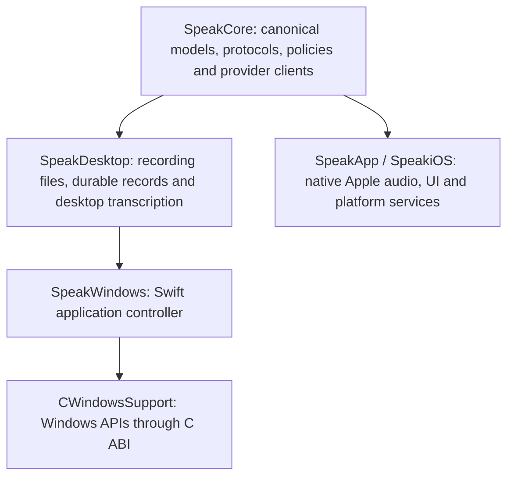

# Windows development and shared Swift core

The Windows target is an **initial native developer build, not a feature-complete
Windows release**. Feature parity with the macOS application remains the product
acceptance criterion. The current implementation does not meet that criterion.
Do not describe a successful build, test run or artifact upload as parity or
shipment.

The implementation keeps Swift for shared behaviour and uses a narrow C ABI to
Windows APIs for the desktop shell, microphone, hotkey, credentials and text
output. Apple audio, UI, local inference and security integrations retain their
native implementations. No web view or separate process is introduced into the
Apple capture path.

## Build and run

Windows CI uses **Swift 6.2.3, Windows Server 2022, x86_64**. Follow the official
[Swift Windows installation guide](https://www.swift.org/install/windows/) for
Visual Studio C++ tools, Windows SDK and Swift prerequisites. That page includes
previous Swift releases; select 6.2.3 to reproduce CI. Windows ARM64 has a
separate native workflow with native-execution evidence, described in
[Windows ARM64](windows-arm64.md); it has no CI receipt yet.

In PowerShell from the repository root:

```powershell
swift --version
python scripts/verify-portable-core-boundary.py
swift build --configuration release --product SpeakWindows
swift test --configuration release
$bin = swift build --configuration release --show-bin-path
& (Join-Path $bin.Trim() 'SpeakWindows.exe') --self-test
& (Join-Path $bin.Trim() 'SpeakWindows.exe') --ui-smoke-test
& (Join-Path $bin.Trim() 'SpeakWindows.exe')
```

The current source offers microphone recording, audio-file import and **all 31
static remote batch models across seventeen provider families**: OpenAI, Groq,
Deepgram, ElevenLabs, Google Gemini, xAI, Cartesia, Gladia, Speechmatics, Meta,
Azure, Mistral, Soniox, Rev.ai, Modulate, AssemblyAI and OpenRouter. The canonical
shared catalogue owns their identifiers, metadata and routes. OpenRouter model
discovery uses the same cache and refresh policy as Apple; native model controls
refresh without changing an active recording or reusing an earlier model index.
Four OpenAI, three Deepgram, one AssemblyAI, Speechmatics, Soniox, ElevenLabs,
Mistral Voxtral, Gladia, Cartesia Ink-2, Rev.ai, two Azure Voice Live and xAI's
dedicated speech-to-text live models use shared Swift clients with the native
WinHTTP transport. The xAI stream (`xai/speech-to-text-streaming`, 24 kHz PCM) is
source-wired with fake-transport tests only and still needs a Windows provider
receipt; the Grok Voice conversation route stays unavailable. Gladia
(`gladia/solaria-1-streaming`) creates its single-use session with an HTTPS
request, then streams on the WinHTTP socket that session names; the account key
never reaches the socket. Cartesia (`cartesia/ink-2-streaming`) completes a
finish only on the server's normal closure (1000) after its `close` command,
read from the close status the transport reports. Rev.ai
(`revai/machine-v2-streaming`) holds audio until the server's `connected`
message and completes a finish only on the normal closure that follows a
delivered `EOS`; a closure before `EOS`, any other status or a dropped
connection fails visibly, and its access token travels only in the socket
query, which is never logged. All three have fake-transport and synthetic
loopback tests, the latter also over WinHTTP in the probe step. Cartesia's
production handshake (`Authorization: Bearer`, `Cartesia-Version` 2026-03-01)
and its normal closure after `close` were confirmed once against the live
service on 2026-09-23 through the Apple URLSession transport, by the opt-in
`CartesiaServiceAcceptanceTests` probe (one test, no failures, 1.575 s, run by
the integrator with an existing key held in memory only). That probe streams
one second of generated silence, so it is not a Windows receipt: the WinHTTP
path against the real service and transcription accuracy remain unproven, and
none of the three has a Windows provider receipt yet. Azure Voice Live
(`azure/azure-speech-streaming` and `azure/mai-transcribe-streaming`, 24 kHz PCM)
connects only to the resource endpoint saved in Settings → Azure Speech
resource…, with no regional fallback, and leaves the language to Azure's
multilingual detection. A finish ends only once Azure acknowledges its commit
and finalisation barrier and every turn has settled; any other server error,
including one naming the barrier, is a failure. It has fake-transport tests and
synthetic loopback tests over WinHTTP in the probe step, and no Windows provider
receipt yet. A WinHTTP socket whose native
destruction cannot yet complete keeps its handles and callback context owned by
a release queue that retries with capped backoff; at four such sockets new live
connections are refused with a retryable error rather than accumulating native
state. Batch and Live retain separate model
selections. Native capture is joined before finalisation; received text and audio
survive cancellation or failure, with no automatic insertion on failure.
The global shortcut defaults to `Ctrl+Alt+Space` with press-to-toggle. The
Keyboard shortcut dialog chooses another Ctrl or Alt combination and any of the
four canonical activation styles (Press to Toggle, Press & Hold, Double Tap,
Hold & Double Tap). A combination another app or Windows already owns is refused
before the working one is released. Gesture styles report the native press and
the release, observed by polling the key only while it is held, to the shared
SpeakCore gesture machine and session policy that state the macOS rules; a
gesture stops only the kind of session it started.
Automation is off by default. Settings → Allow automation starts a named-pipe
server, `\\.\pipe\JustSpeakToIt-SpeakApp-automation-<user SID>`. It rejects
remote clients, its DACL grants only the current user, and each client is
checked after its first bytes by impersonation: same user, not a network logon,
not below the app's integrity level. The `speak` CLI (`speak.exe`) uses the
same wire protocol, framing, command dispatch and replay coordinator as the Mac
UNIX-socket transport. It offers `status`, `history`, `transcribe`, `listen`,
`stop` and `mcp`. Automation transcription uses the remembered batch model and
never adds a History entry. Automation dictation runs the Record pipeline with
no captured field. `SPEAK_AUTOMATION_PIPE` overrides the pipe name for both
sides. Save the
selected provider's key through the application; each provider uses its canonical
credential identifier in Windows Credential Manager. The app stores settings and
durable recording records under
`%LOCALAPPDATA%\JustSpeakToIt`. A recorded file and pending history record exist
before network transcription starts, so an interrupted request does not discard
the source recording. Closing the window cancels every request and waits at
most `DesktopHostShutdown.grace` (5 s) for them; one that ignores cancellation
is left behind, cannot reach the window, and its record is recovered with its
audio at the next launch. The microphone selector persists either the Windows default
or an exact endpoint identifier; an unavailable selected device is reported
without silently switching microphones. A coalesced native subscription refreshes
the device list after connections, removals, names and default-device changes.
Snapshots are enumerated off the UI/controller and applied only when idle;
recording keeps its captured device. Missing selected devices retain an
unavailable row and recover their normal label when reconnected. See
[Windows microphone discovery](windows-microphone-discovery.md) for lifecycle,
synthetic checks and remaining hardware acceptance. Transcription and post-processing can be
cancelled while keeping audio and any completed result.

Imports are checked before copying: regular audio files, supported extensions,
non-empty and at most 25 MB. Meta and Azure accept the app's canonical 16 kHz mono PCM16 WAV directly.
Other inputs for those providers use a cancellable in-process Media Foundation
converter, retaining the original in History and removing private temporary WAV
output afterwards. The converter uses installed Windows codecs; it does not
promise support for every Ogg, Opus or WebM encoding. Native Windows decode/cancellation tests passed; run 35725040396 also decoded generated AAC/M4A and MP3 fixtures, checked their non-silent signal and retained originals.
Other compressed formats and physical-device acceptance remain pending. Canonical recordings bypass decoding after a 44-byte header probe. Azure keys accept `key:region` (a raw key defaults to eastus);
Settings → Azure Speech resource… saves the resource endpoint (as `azureSpeechResourceEndpoint`,
the Apple apps' key), which recorded audio uses when set. Mistral, Soniox and Rev.ai stream multipart bodies
from temporary files, using a native protected ACL for the current Windows user
and SYSTEM. Creation refuses existing files and reparse-point paths; completed,
failed and cancelled uploads remove their staging files. Soniox removes accepted
remote file/job resources after completion, failure and cancellation; a failed
job deletion still attempts file deletion. Rev.ai retains its existing remote-job
retention policy.

The native History pane selects saved recordings, retries batch transcription with
the recording's original model, exports transcript text through an overwrite-
confirming save dialog, and opens retained audio in its registered Windows
application. Live recordings direct users to Batch and Import for retranscription.
Retry and audio actions capture the selected record's identifier. Copy and Export
capture the displayed text and version on the UI thread, before asynchronous
work or the save dialog; a retry replacing the same saved record cannot change
their content. Selection and version events use one worker and one latest pending
value. Text, status and version render together only for the current selection;
changing selection or version clears stale text and disables Copy and Export
until the matching content is displayed. A native search box
filters the rows by original transcript, processed transcript, captured app
profile name or canonical friendly model name. Matching uses Foundation's full case folding and Latin,
Greek and Cyrillic diacritic folding through the shared `SpeakDesktop` policy,
keeps marks that spell words in other scripts, never modifies records or
transcripts, and
rows keep their stable identifiers in newest-first order. Keystrokes coalesce
into one in-flight query, so typing never queues work per keystroke. If the
selected record stops matching, its displayed text and record-bound actions
clear until the search is cleared or another row is chosen. Where a record
retains both transcripts, a Transcript version control switches the displayed
text; it defaults to the processed text, Copy and Export use the version shown
for the captured record, and Retry and Open audio always use the original
recording. Native Play/Pause, Stop and an elapsed/remaining display play the
selected recording in the app: the original file stays pinned read-only and
is decoded by the installed Media Foundation codecs to the output endpoint's
own format, then rendered through event-driven WASAPI; Open audio remains
the explicit external-player action. Playback stops before recording,
importing, switching records or closing, and hardware output remains a
separate acceptance gate. See
[Windows History playback](windows-history-playback.md). History import and
retention controls are not implemented yet.

Post-processing is disabled by default. The native Post-processing dialog can
opt into OpenRouter, choose a shared catalogue model, edit its instructions and
save a separate OpenRouter key in Credential Manager. Apply submits these
settings together. The original transcript is saved before the shared
post-processing client runs; processed text is stored separately. Empty
transcripts remain empty, and a processing failure retains the original and its
failure reason. Local post-processing and live polish are not wired into Windows.

App profiles use the canonical `DictationProfile` data model and ordered matching
policy. The native editor supports add/remove/reorder, full executable paths,
model and language overrides, post-processing mode/model/prompt and output
language. The original executable identity is captured before recording. Its
first matching profile becomes an immutable session snapshot, leaving normal
settings unchanged. Unavailable models, inherited values and Apple-only matchers
survive edits; unsupported overrides have an explicit notice retained in History.
Atomic persistence and queued settings application precede the next recording.
Spoken-language overrides reach supported live models through their shared client,
as each model's canonical capability allows: OpenAI, Deepgram Nova and multilingual
Flux, Speechmatics, Soniox, ElevenLabs, xAI speech-to-text, Gladia and Rev.ai.
Gladia's session request pins one of its documented language codes; a language it
does not list lets Gladia detect the language instead. Rev.ai's socket query
carries one of its nine documented codes (Mandarin as `cmn`); as on Apple
platforms, Automatic resolves the system language first, and a language Rev.ai
does not list is omitted, which Rev.ai reads as English, without a profile notice
yet. English-only Flux, AssemblyAI,
Cartesia Ink-2 (English only, with no language field) and Voxtral retain a
model-specific limitation; Automatic keeps the model's normal language
behaviour without a warning. Personal lexicon overrides are not applied yet.

Automatic insertion targets the control that had focus when the hotkey fired
and re-verifies the captured process, thread, foreground window and focused
control before every delivery. Native Unicode `Edit`/`RichEdit` controls
receive the text directly at the caret or over the selection. Other editable
controls (browser, Electron, XAML, WPF and Office fields) are resolved through
UI Automation on a bounded background worker: an empty field or a fully
selected field is set through the Value pattern, and everything else uses a
guarded clipboard paste that snapshots and restores the previous clipboard
content, excludes the transcript from clipboard history and reads the field
back to confirm the insertion. Password, read-only and disabled fields, a
changed focus or field, and elevated applications fail closed with a Copy
fallback message. A native **Text output** dialog chooses Smart, direct-only
or clipboard-only output, insertion at the cursor or over the whole field, and
clipboard restoration after a Smart paste. Each recording keeps the choice
saved when its Record event was queued; a later Apply affects only later
recordings. Clipboard-only output needs no captured field, so it also copies
recordings started with Record in this window, as an ordinary copy like Copy
transcript that can appear in clipboard history. See
[Docs/windows-text-insertion.md](windows-text-insertion.md) for the policy,
the deterministic native self-test and the remaining physical acceptance
gates: browser, Electron and Office insertion has synthetic coverage only.

The native-build developer artifact contains an executable, resources and
source/compiler metadata and requires installed Swift 6.2.3 and Visual C++
runtimes. The cross-build workflow also produces a separate
`windows-runtime-bundle` artifact containing an unsigned developer ZIP with the
production executable, resources, authenticated runtime DLLs, licences and
per-file hashes. That ZIP is intended to run after extraction without installing
Swift or an SDK. Its isolated runtime checks must pass for the exact revision
before this can be treated as verified distribution. See
[Windows runtime bundle](windows-runtime-bundle.md) for extraction, provenance,
search-path isolation and the negative controls. Neither artifact is a signed
installer, automatic update or supported Stable Windows release.

The same workflow's `package-lifecycle` job packs that bundle into an
**unsigned developer MSIX** with Microsoft's MakeAppx and uploads it as
`windows-developer-msix-unsigned`. On the disposable runner it is designed to
sign copies with an ephemeral test certificate, then install, launch, refuse
failed and cancelled upgrades, upgrade and uninstall while checking that
`%LOCALAPPDATA%\JustSpeakToIt` is kept. That job has not produced a Windows
receipt yet. Installing the package elsewhere needs an externally supplied
signing certificate. It is a developer identity outside the Alpha and Stable
trains; see [Windows developer MSIX package](windows-installer.md).

### Shared-core checks on other hosts

On macOS, use the Xcode Apple toolchain:

```sh
SPEAK_PORTABLE_CORE=1 xcrun swift test --configuration release
```

The normal Apple build still uses `make build` / `make test` with its established
dependency graph. The environment switch selects the portable graph only; it
also disables Apple-framework capability probes so the same unavailable-model
behaviour can be tested locally.

On Linux, install Swift 6.2.3 using the
[official Linux installation instructions](https://www.swift.org/install/linux/)
and run `swift test --configuration release`. CI uses the official
`swift:6.2.3-jammy` container pinned to its image digest. That job is the
portability gate for the libraries. The Linux desktop app (`SPEAK_LINUX_TARGET=1`)
shares the Windows controller through `SpeakDesktopHost`; see
[linux-development.md](linux-development.md).

Without `SPEAK_LINUX_TARGET` the portable graph has no external Swift package
dependencies and may remove `Package.resolved` while resolving; the Linux app
graph (SwiftNIO) rewrites it. Preserve the Apple lockfile: restore only
that file from the starting revision after portable validation, provided it had
no unrelated changes before the run. Do not commit its deletion.

The app and complete XCTest executable now **cross-compile from macOS** using a
private, pinned official Swift 6.2.3 toolchain, LLVM 20, Microsoft SDK and MSVC
libraries. The existing Xcode installation and normal Apple build graph stay
unchanged. Follow [the cross-build guide](../scripts/windows-cross/README.md).
The full app workflow copies those exact Mac-built executables to a Windows
runner and verifies their source revision and hashes before execution.
[Release cross-build run 35735185760](https://github.com/crmitchelmore/justspeaktoit/actions/runs/35735185760)
passed at `ac7b5416`: the Mac-built XCTest executable ran **378 tests, 10 optional
skips and zero failures** on Windows, and the production app passed native
self-tests and window smoke checks. The production executable is built and
copied before the separate test-enabled build; metadata verifies
`configuration=release` and `appBuiltForTesting=false`. Its SHA-256 is
`36d633960b12c80b5f3fec2b9aba4183c63ea915a6653723c08cecfc9934fe58`.
The [exact developer artifact](https://github.com/crmitchelmore/justspeaktoit/actions/runs/35735185760/artifacts/10698245839)
is an optimised cross-built app, with the runtime prerequisites described above.

After the model-specific language profiles and dedicated xAI live client were
integrated, the macOS portable suite passed **385 tests, five expected optional
loopback skips and zero failures**. This covers the combined shared source;
native Windows, full Apple and API compatibility checks must also pass for that
revision before it is promoted. It is not a live Windows xAI provider receipt.

At `dc27f528`, the full normal Apple suite passed **3,733 tests, 16 skips and
zero failures**. [Native Windows run 35741471380](https://github.com/crmitchelmore/justspeaktoit/actions/runs/35741471380)
passed **423 tests, ten optional skips and zero failures**, the five independent
WinHTTP probes, and native self/window checks. Its matching
[release cross-build run 35741471399](https://github.com/crmitchelmore/justspeaktoit/actions/runs/35741471399)
also passed. The subsequent Speechmatics integration passed **435 portable
tests, five optional skips and zero failures**; its isolated corrected source
also passed 78 focused Apple tests, including the 25 existing client tests.
Adding the corrected Soniox client brought the combined portable suite to
**466 tests, five optional skips and zero failures**. Its focused normal Apple
gate passed 160 tests. Soniox disconnects, server errors and missing terminal
responses now retain confirmed text for recovery and report failure before
finalisation returns. Physical provider acceptance remains separate.

## Architecture and ownership



| Layer | Current responsibility | Source |
|---|---|---|
| Canonical domain | Model identifiers, provider routes, transcript semantics, Unicode reconciliation, lifecycle ownership, PCM/WAV, comparison and history projections | `Sources/SpeakCore/` |
| Shared batch transport | Seventeen provider routes reuse shared clients, including their HTTP, polling and cancellation behaviour | `Sources/SpeakCore/` provider clients; `Sources/SpeakDesktop/DesktopTranscription.swift` |
| Shared post-processing | Canonical cloud models, cleanup prompts, silence policy and OpenRouter execution | `Sources/SpeakCore/OpenRouterChatClient.swift`, `Sources/SpeakDesktop/DesktopPostProcessing.swift` |
| Desktop behaviour | Implemented-model projection, durable recording records, recovery, export and streaming WAV writes | `Sources/SpeakDesktop/` |
| Windows host | Native-event handling, recording orchestration, settings and credential access | `Sources/SpeakWindows/` |
| Windows services | Event-driven WASAPI capture with a bounded writer queue, native History playback through Media Foundation decoding and event-driven WASAPI rendering, native history/settings UI, hotkey, Credential Manager, clipboard, and captured-field insertion through native controls, UI Automation and a guarded paste | `Sources/CWindowsSupport/` |
| Shared sync | CloudKit record schema and codecs, History and Compare Models reconciliation, the CloudKit Web Services client and a read-only reader for the Mac's encrypted API keys | `Sources/SpeakSync/` except `appleSyncSources` |
| Desktop sync | History projection, synced copies, per-account cursors and acknowledgements, opt-in key import, build-time token resolution | `Sources/SpeakDesktopSync/` |
| Apple services | Existing SwiftUI, AVFoundation, Speech, Core ML, Keychain, CloudKit and Sparkle integrations | `Sources/SpeakApp/`, `Sources/SpeakiOS/`, native adapters in `Sources/SpeakSync/` |

`Package.swift` selects the portable graph on Windows/Linux and when explicitly
requested on macOS. New `SpeakCore` source files enter the portable build by
default. `appleCoreSources` names the existing Apple-bound dependency closure;
a new exception must be an intentional platform adapter, not a duplicate
implementation of domain behaviour. The boundary check rejects duplicate,
missing or stale exclusions and a return to a portable-source allow-list. Native
Windows/Linux CI then catches accidental Apple framework dependencies.

The catalogue remains canonical. Metadata formerly inside Meta, Cartesia,
Gladia and Speechmatics network implementations now has a shared definition;
existing public client constants forward to it. Adding or retiring a model must
update that definition and its invariants once. Windows' executable model list
is an explicit projection of transports that its application actually wires.
Catalogue membership alone is not a capability claim. In particular, do not use
the Apple on-device fallback when a Windows user's API key is missing.

Future shared policies, provider protocols, request parsing, persistence models
and transcript processing belong in `SpeakCore` or `SpeakDesktop`. Native
capture, resampling, permissions, window behaviour, secure storage, insertion,
local inference acceleration and playback belong behind platform adapters.
Keep PCM and inference in process. Do not route the hot path through JSON RPC,
a web view or disk polling merely to share orchestration.

The macOS host currently executes shared live engines for eleven remote provider
families. This includes xAI's dedicated speech-to-text route and Speechmatics
through `SharedClientLiveController`; a platform-specific client class is not
required for those routes. AssemblyAI, Cartesia, Gladia and Modulate still have
duplicate macOS transports. Cartesia and Gladia now also have shared, finalising
clients, which iOS and the Windows projection build; the macOS app still records
through its own controllers for them, and its Compare Models lanes use the
shared clients. Rev.ai has one shared client on every platform: macOS runs it
through `SharedClientLiveController`, iOS through its factory and Windows through
the desktop projection. Deepgram and OpenAI share transport but retain
separate macOS stop orchestration. These are explicit consolidation gaps:
provider changes must still inspect both paths until their adapters are migrated
and their existing capabilities and finalisation behaviour are verified.

WASAPI produces mono PCM16 directly at the selected provider's 16 or 24 kHz
rate in 20 ms frames for Deepgram and 100 ms frames for other routes. A
preallocated, single-producer/single-consumer ring holds at most 640 or 128
frames respectively (12.8 seconds, about 600 KiB at the maximum rate). Its capture-side push performs no heap allocation, mutex
acquisition or disk I/O. A separate writer invokes the Swift file callback;
stop flushes the final partial frame, drains the queue and joins the writer
before closing the recording file. Overflow stops recording with an explicit
error instead of silently dropping frames. These bounds are source guarantees,
not measured latency or microphone-device acceptance.

## Feature parity matrix

“Implemented” below describes source wiring, not completed device acceptance.
The exact CI run and target-device evidence must accompany any promotion in
status. A platform-specific replacement may provide the same user capability,
but must not be presented as the identical Apple-only engine or service.

| Feature | Windows state in this change | Remaining acceptance work |
|---|---|---|
| Recording and file import | WASAPI PCM capture, native controls and file selection implemented | Physical microphones, device changes, permission denial, interruption and long-session recovery |
| Batch transcription | All 31 static remote models through shared clients, plus shared OpenRouter discovery and native refresh | Final-head Windows/Linux CI, real provider receipts and supported formats/languages |
| Live transcription | Four OpenAI, three Deepgram, one AssemblyAI, Speechmatics, Soniox, ElevenLabs, Mistral Voxtral, Gladia, Cartesia Ink-2, Rev.ai, two Azure Voice Live routes (to the saved resource endpoint) and the xAI dedicated speech-to-text model use shared clients and native WinHTTP (Gladia's session request is HTTPS); Grok Voice is not exposed | Final-head native host checks, Windows provider receipts including real xAI, Speechmatics, Soniox, ElevenLabs, Mistral, Gladia, Cartesia, Rev.ai and Azure streams (Cartesia's handshake and normal closure are confirmed over Apple URLSession only; Rev.ai's normal closure after `EOS` follows its documentation and reconnection tutorial but has no live receipt yet; Azure's commit and barrier acknowledgements have no live receipt for the shared client yet), and the remaining streaming providers: Google, Meta and Modulate |
| Global shortcut | Configurable Ctrl/Alt combination with conflict refusal, and all four activation styles: press-to-toggle natively; hold, double-tap and both through the shared SpeakCore gesture machine and session policy. Local Windows cross-compilation and portable gesture/policy tests pass; the native dialog, registration and release polling are covered by the window smoke test with fake registration and key state | Windows CI for this revision, physical keyboard acceptance of hold/double-tap timing, user-adjustable timing, the macOS host adopting the shared machine (it keeps its own `GestureDetector`), hands-free arming and Escape cancel |
| Text output | Captured-field insertion: native Edit/RichEdit caret/selection replacement, UI Automation Value pattern for empty or fully selected fields, guarded history-excluded paste with clipboard restore and read-back verification, field-identity and password/read-only/elevation refusal; native Text output dialog for Smart, direct-only and clipboard-only output, replace-field and clipboard restoration; each recording keeps the choice read at its Record event; clipboard-only output also copies in-app recordings as an ordinary copy | Windows CI and physical keyboard/screen reader/DPI acceptance of the dialog, physical browser/Electron/Office/XAML acceptance, undo, streaming insertion and voice edit |
| On-device transcription | Local batch recording and file import through a run-time loaded whisper.cpp 1.9.4 (best CPU variant, or Vulkan on any vendor's GPU when a driver is present). Four canonical Whisper entries (tiny, base, small, large-v3-turbo) are projected from the shared catalogue with pinned GGML files, sizes and SHA-256; the native Local models dialog downloads (resumable, atomic, verified), cancels, removes and sets the GPU choice. Source picker: Remote or Local, then Batch or Live; Local offers Batch only, so the Mode picker hides for it. Runtime DLLs are built from the pinned commit in CI and shipped in the bundle and MSIX with licence and provenance; the native job and the self-contained bundle transcribe the JFK sample with the tiny model | Windows CI receipt for this revision, local streaming, Hugging Face import, real Vulkan hardware (the runners have no GPU), CPU/GPU throughput and memory on physical PCs, and local post-processing |
| Post-processing | Opt-in shared OpenRouter execution, canonical model selection and custom prompt; original and processed text retained separately; empty transcripts stay empty | Final-head Windows/Linux CI, real OpenRouter receipts, local execution, live polish and full Apple settings parity |
| Personal vocabulary | Shared correction/lexicon data models compile | Editing UI, correction learning and provider bias integration |
| Profiles and settings | Native ordered per-app editor and shared validation; immutable recording overrides, model-specific live language hints and preserved unknown values | Final-head native UI, physical executable matching, remaining settings and lexicon overrides |
| History | Native record selection, case/diacritic-insensitive search over original/processed text and friendly model names, original/processed transcript selection for copy and export, retry, text export, external audio opening and in-app playback with Play/Pause, Stop and elapsed/remaining through Media Foundation and WASAPI; durable original/processed results and interrupted-recording recovery | Final-head UI smoke and device acceptance, physical speaker/Bluetooth/USB playback, history import and retention controls |
| Model comparison | Shared rounds, scoring and transcript differences compile | Native comparison UI, parallel execution and audio/provider isolation |
| Voice output | Read aloud speaks the displayed History transcript (the version shown) with a canonical Deepgram Aura or Flux voice chosen in a native Voice dialog. Transcripts longer than Deepgram's 2,000-character request limit are spoken as consecutive sentence-bounded segments (shared `SpeechTextSegmenter`). Speech plays through the same `WindowsAudioPlaybackController` as History playback, so only one is ever audible; Play/Pause and Stop act on it, and recording, import, selecting another row, History playback and close stop it, including a segment still being synthesized. The shared Deepgram engine keeps its bounded WAV validation, exclusive private staging and owned-file cleanup, and the Read aloud controller (`DesktopHostReadAloud`, SpeakDesktopHost) is shared with Linux; Windows supplies its player, engine staging and Voice dialog. Normal speed only. Cross-compiled locally; awaited-playback controller tests pass under a local Windows ABI runner | Windows CI for this revision, a real Deepgram receipt (including Flux linear16/WAV), physical speaker acceptance, speed control, system voices, other providers, pronunciation editing, clipboard and selected-text sources, and removal of staged files left by an earlier launch |
| Hands-free dictation | Domain seams exist; no Windows workflow | Native VAD, pre-roll, endpointing and recovery |
| Credentials | Windows Credential Manager uses canonical identifiers for the seventeen transcription provider families | Physical credential lifecycle acceptance, credential removal UI and remaining providers |
| Sync and Apple companion flows | History syncs with the Mac App Store build's CloudKit container (`iCloud.com.justspeaktoit`) through CloudKit Web Services: Settings, iCloud sync signs in with an Apple ID in the browser (loopback callback), shows Mac History as audio-less synced copies and uploads Windows History in the Mac's record format. Opt-in, read-only import of the API keys the Mac syncs, unlocked with the Mac's key-sync passphrase. Native WinHTTP transport, CNG envelope, Credential Manager for the rotating token. Portable tests and Windows loopback tests run against a fake CloudKit server; see [iCloud sync](#icloud-sync) | The CloudKit Console steps below, then a live receipt: Mac to Windows and Windows to Mac History create, edit and delete, key import, account switch and token expiry. Settings do not sync (the Mac uses the iCloud key-value store, which has no web API); Compare Models rounds, iPhone History (a separate container) and Handoff are not wired |
| Automation and integrations | Opt-in `speak` CLI and MCP server over an owner-only local named pipe: status, history, file transcription, and start/stop dictation. It shares the protocol, framing, dispatch and replay with the Mac socket transport. Loopback client/server, CLI path resolution and MCP tests pass under a local Windows ABI runner. The native pipe self-test (runs in `--self-test` and CI) needs real Windows, because the local runner does not enforce first-instance ownership | Windows CI for this revision, a physical check of the Settings menu toggle and of `speak` against a running app, packaging `speak.exe` onto PATH in the MSIX, OpenClaw, deep links, AppleScript/Shortcuts-equivalent surfaces |
| Diagnostics and insights | Shared timing/history/comparison data available | Windows UI, telemetry consent/redaction and end-to-end diagnostic receipts |
| Distribution and updates | Unsigned developer executable, self-contained runtime bundle (including the on-device runtime), and an unsigned x64 developer MSIX with a CI install/upgrade/uninstall lifecycle job that keeps user data in the portable data directory. A CI `sign` job signs a copy with Azure Artifact Signing through GitHub OIDC once its secrets and variables exist, and otherwise logs that the unsigned package is kept ([windows-installer.md](windows-installer.md#signing)) | First Windows receipt for that job, the owner's Artifact Signing identity validation and a first signed receipt, clean physical Windows 10/11 installs, ARM64, update channel and Alpha/Stable Windows identities |

Apple-specific UI surfaces such as Siri, Live Activities, the iOS keyboard and
Apple Watch are not Windows operating-system APIs. Their relevant user journeys
must be enumerated and either supported through companion protocols or recorded
as explicit product decisions before claiming parity. They are not silently
waived by a successful Swift build.

## On-device transcription

Windows transcribes recordings and imported files without a network connection
through [whisper.cpp](https://github.com/ggml-org/whisper.cpp) 1.9.4. It is
the runtime most Windows desktop speech apps already ship: it underpins
[Buzz](https://github.com/chidiwilliams/buzz),
[Vibe](https://github.com/thewh1teagle/vibe) and
[Whispering](https://github.com/epicenter-so/epicenter), has official Windows
CPU, CUDA and Vulkan builds in its
[releases](https://github.com/ggml-org/whisper.cpp/releases), and is a plain C
API that CWindowsSupport can load without Python, .NET or ONNX Runtime.
Alternatives were rejected for this slice: faster-whisper (CTranslate2) needs a
Python host and runs on the GPU only with NVIDIA CUDA; sherpa-onnx (the earlier
`codex/opus55-windows-local-runtime` draft) adds ONNX Runtime, tar.bz2
extraction and a second model format, and Windows ML/DirectML has no maintained
Whisper pipeline. The draft's shared catalogue refactor in SpeakCore is kept and
reused; its sherpa and bzip2 path is not.

- **Catalogue.** `WhisperCppModels` (SpeakCore) maps existing canonical
  `local/whisperkit/...` Whisper entries to pinned GGML files from
  `ggerganov/whisper.cpp` on Hugging Face at a fixed revision, with byte counts,
  SHA-256, licence and provenance. `LocalModelHostSupport.windows` projects the
  shared catalogue through that backend, so Windows lists only models it can
  run; distilled entries are excluded because no pinned GGML conversion exists.
- **Download.** `LocalModelInstaller` (SpeakDesktop) downloads with HTTP Range
  into a `.partial` file, resumes after a dropped connection, hashes the whole
  file with CNG, then renames it atomically and writes a receipt. A tampered or
  truncated file is deleted and never used: when the runtime loads a model it
  hashes each byte with CNG as it hands it to whisper.cpp, through one open
  file, and frees the model unused unless the digest matches the pin, so a file
  replaced or rewritten at any moment cannot supply unverified bytes. The
  cached model is reused only for the same path and digest; the host then
  deletes a refused file and its receipt.
  Models live in `%LOCALAPPDATA%\JustSpeakToIt\LocalModels` with the owner-only ACL.
- **Runtime.** `WindowsWhisper.cpp` loads `whisper.dll` from the application
  directory with a restricted search path, refuses any `whisper_version()` other
  than the pinned one, and registers ggml backends from that directory only.
  With the GPU choice on, ggml picks Vulkan when `vulkan-1.dll` and a device are
  present, otherwise the best CPU variant. Models stay loaded between
  recordings; cancelling a recording aborts inference.
- **Removal.** `LocalModelOwnership` (SpeakDesktop) refuses to remove a model
  that a recording, import or transcription uses, which a profile may choose
  instead of the selected model, and never lets a download and a removal of one
  model overlap. `LocalModelTeardown` deletes the files, then asks the runtime to
  free its cached model on its own queue, because freeing waits for a running
  recognition; the controller stays free to cancel or record meanwhile. The
  runtime frees the model only if it was loaded from the removed file, checked
  under the lock it loads under, so a model loaded in its place stays warm.
  Deleting first is safe: the runtime closes a model's file once it is loaded.
  The controller side of downloads, readiness, recognition and removal lives
  in `SpeakDesktopHost` (`DesktopHostLocalModelManagement.swift`), shared with
  Linux; `WindowsLocalModels.swift` supplies CNG, `whisper.dll` and the dialog.
- **Controls.** The window's Source picker chooses Remote or Local above Batch or
  Live (Local has no live models yet, so Mode hides for it); Remote Batch,
  Remote Live and Local keep separate saved models. Local
  recordings skip API keys and the provider upload cap. Silent recordings stay
  empty. History and headers show the friendly name, for example "Whisper Tiny
  (on-device)". History Retry transcribes a local recording again with its own
  saved model and language, whatever the pickers show, after checking that the
  model is downloaded and the runtime can run; if not, the recording and its
  audio are left untouched and the status says why. Only genuinely live-only
  recordings get the import guidance (`DesktopHistoryRetry`, SpeakDesktop).
- **Checks.** `--self-test` covers CNG vectors, a download, resume, tamper
  and removal cycle, the controller's removal ownership with a held
  transcription and teardown and, with the runtime beside the app, a held
  import, and History Retry of on-device recordings through the real
  controller: its own model, language and audio, refusal without a model or
  runtime, and failed or silent retries keeping the recording. With the
  runtime present, the platform tests also delete a loaded model's file and
  hold a removal while another model replaces it in the cache.
  `--local-transcription-self-test <wav> --expect <phrase>`
  downloads the pinned model into `JSTI_LOCAL_MODEL_DIRECTORY` and transcribes
  the WAV; CI runs it on the native build and from the self-contained bundle
  with the JFK sample. `JSTI_WHISPER_RUNTIME_DIRECTORY` points a developer
  build at runtime DLLs outside the executable directory.

The runtime build, its pins and the bundle integration are described in
[windows-runtime-bundle.md](windows-runtime-bundle.md#on-device-transcription-runtime).

## iCloud sync

Windows joins the **Mac** CloudKit container, so a user's Mac History appears
on Windows. Only the Mac App Store build writes to that container; the direct
(Developer ID) Mac build ships without CloudKit entitlements, so its History is
not in iCloud. iPhone History lives in `iCloud.com.justspeaktoit.ios` and is a
separate container. The formats, protocol evidence and limits are in
[Windows CloudKit sync](windows-cloudkit-sync.md).

What the Windows app does:

- **Settings > iCloud sync** opens the dialog. **Sign in** asks CloudKit for
  Apple's sign-in page, opens it in the default browser (only `https` pages on
  `apple.com` or `icloud.com`), and listens on
  `http://127.0.0.1:47823/cloudkit-sign-in` for the redirect carrying
  `ckWebAuthToken`. The listener runs only during sign-in, for at most ten
  minutes, and takes the redirect only from a process of the signed-in
  Windows user and only as a top-level browser navigation (see
  [Sign-in callback](windows-cloudkit-sync.md#sign-in-callback)). The token rotates on every response and is kept in Credential
  Manager as `com.justspeaktoit/cloudkit.webAuthToken`.
- **Sync History with my Mac** turns on History sync. The app syncs at launch,
  every five minutes, after each saved transcript, and on **Sync now**.
  Transcripts from the Mac appear with "from your Mac" and refuse playback,
  opening audio and retry, because their audio stays on the Mac. When the Mac
  deletes one of them, it is removed here. When the Mac deletes a recording
  that was made on this PC, this PC keeps its own copy and audio and never
  uploads it again.
- **Import API keys my Mac syncs** is off by default. It needs the key-sync
  passphrase that was set on the Mac. Only the derived key is stored in
  Credential Manager, as `com.justspeaktoit/cloudkit.apiKeySyncKey`; the
  passphrase is not. The app imports keys only from the canonical list in
  `SyncSchema.EncryptedSecret.syncableIdentifiers`. It never writes keys to
  iCloud. A key you type yourself, in Settings or in the post-processing
  dialog, is never removed by a later deletion on the Mac, even one that
  arrives as you save it; a newer key from the Mac still replaces it, as it
  replaces any saved key. The latest choice wins: turning import off, or on
  again with another passphrase, overrides a turn-on that is still in progress.
- Sync state (the cursor, the bound iCloud user, acknowledgements and which
  keys were imported) is in `%LOCALAPPDATA%\JustSpeakToIt\CloudSync\state.json`.
  Signing out keeps it. If another Apple ID signs in, that state is reset and
  nothing on this PC is deleted; every syncable History record then uploads to
  the new account, both recordings made on this PC and transcripts downloaded
  from the previous account. That second part is open for review; see
  [Changing Apple ID](windows-cloudkit-sync.md#changing-apple-id).

The CloudKit API token is not a Mac credential. Apple apps use the operating
system's CloudKit session, and no token from them can be reused here. The API
token is created per container in CloudKit Console and compiled into Windows
builds as a build setting. A build without one shows "iCloud sync is not
available in this build" and works normally otherwise. For local development,
set `JSTI_CLOUDKIT_WEB_API_TOKEN` (and `JSTI_CLOUDKIT_WEB_ENVIRONMENT=development`
to use the Development environment) before starting the app.

### One-time setup the container owner must do

1. **Deploy the schema to Production.** In
   [CloudKit Console](https://icloud.developer.apple.com/), select the
   `iCloud.com.justspeaktoit` container, open **Schema**, and check that
   **Production** lists the record types `TranscriptionHistory`,
   `EncryptedSecret`, `EncryptedSecretMetadata` and `ModelComparisonRound`.
   If any is missing, deploy from Development with **Deploy Schema Changes…**
   and confirm. CloudKit Web Services can only see what is deployed to
   Production. The repository has no record of a Production deployment; the
   Alpha rollout checklist lists "deploy the matching CloudKit schemas" as
   outstanding evidence. Repeat for `iCloud.com.justspeaktoit.alpha` if Alpha
   builds should sync.
2. **Create the API token.** In the same container, open **Settings** (or
   **API Access** in older Console layouts), then **Tokens & Keys**, and add a
   new **API Token**:
   - Name: `Just Speak to It for Windows`.
   - **Sign in Callback**: choose **URL Redirect** and enter exactly
     `http://127.0.0.1:47823/cloudkit-sign-in`.
   - Allowed origins: leave the default. The Windows client is not a browser
     and sends no `Origin` header.
   - Save it and copy the token value.
3. **Add the CI secret.** In GitHub, open **crmitchelmore/justspeaktoit >
   Settings > Secrets and variables > Actions > New repository secret**, name
   it `CLOUDKIT_WEB_API_TOKEN`, and paste the token. The macOS to Windows Swift
   Proof workflow writes it into the build with
   `scripts/windows-cloudkit/configure-cloudkit-web.py` on pushes to `main` and
   manual runs. Pull request builds never receive it.
4. **Check the callback once.** Install a build made with the secret, sign in
   from Settings > iCloud sync, and confirm the browser lands on "Signed in".
   If Console refuses a plain `http://127.0.0.1` callback, record that in issue
   #1157: the client would then need a custom URI scheme activation through
   the MSIX manifest, which is not implemented.

## Verification and performance thresholds

[The Windows workflow](../.github/workflows/windows.yml) builds the native x64
executable in release configuration, runs shared and Windows adapter tests,
runs `--self-test`, then requires `--ui-smoke-test` to finish within 30 seconds.
It also runs release tests for the portable graph on macOS and
Linux. The actions have read-only repository permissions and require no real
provider keys.

The Windows, Windows ARM64, macOS to Windows proof and Linux workflows are
advisory: they run on pull requests and on `main`, but they are not required
checks in the `main` ruleset, and nothing else waits for them. Alpha releases
follow `CI` only. A red desktop workflow is still a regression to fix, but it
never blocks an Apple merge or release.

The native self-test checks UTF-8/UTF-16 round trips, invalid encoding, PCM frame
boundaries, silent packets, stop flushing, bounded queue overflow/wrap/FIFO/drain
behaviour, writer failure reporting and rejection of an invalid insertion
target. The text output self-test then drives the insertion adapter against
app-owned hidden Edit/RichEdit controls on a helper thread through injected
foreground, clipboard and keystroke seams: caret and selection insertion,
surrogate pairs, replace-field, stale focus and foreground, password/read-only
refusal on both the native and UI Automation paths, the Value pattern for
empty and fully selected fields, the guarded paste with exact clipboard
restoration, keystroke failure, unverifiable pastes, a clipboard changed by
another application, bounded timeouts, bounded destroy of a blocked worker and
worker cleanup. It never sends real input or touches the system clipboard, and
it is not evidence of insertion into a real browser, Electron or Office
window. The self-test also checks clipboard-only output without a captured
field on an in-memory clipboard, and runs the controller's recording, settings
and output workflow with synthetic capture, providers and output to check
that each recording keeps the text output read at its Record event. The
current UI smoke test creates a real native window and checks its
minimum-size control bounds, atomic history replacement, preserved selection,
history action identifiers, search query events with filtered-snapshot
selection clearing and restoration, transcript version defaults with copy and
export version identity, microphone selection snapshots, cancellation, a
hidden post-processing dialog's atomic Apply callback before shutdown, and the
Text output dialog's choices, Cancel/Escape/Enter, keyboard order, minimum
bounds and modal recording refusal. Profile
smoke checks cover CRUD, ordering, preservation, validation, modal hotkey refusal,
keyboard scrolling and narrow window layout. Model-list smoke checks exercise
refresh, retained selection and transition from batch-only to live-capable lists. Native
storage tests check protected ACLs, existing-file refusal and junction rejection.
The playback self-test drives the production decode, queue and render loop
against a synthetic audio engine without a speaker: exact output bytes with
no trailing silence, source position through pause/resume, cancel and the
final drain, pause before start, event timeout, device failure, immediate
completion, refused second start, callback self-destroy refusal and release
of the pinned source; the window smoke test adds record-bound playback
controls and recording lockout. Hardware playback tests probe the endpoint
explicitly and skip only the audible checks when Windows reports none.
The combined additions passed native CI at `ae61b2e8` and `ac7b5416`, and the
Mac-built release app passed at `ac7b5416`; later revisions require their own checks.
The first playback run at `71be64f2` executed 535 Windows tests with 13 optional
skips and one failure: refusing an oversized source left an input handle pinned.
The reviewed correction retains temporary ownership until validation succeeds;
a regression checks both handle ownership and whether the file can be reopened.
The standalone bundle run also found an empty-environment cleanup failure before
launch. The cleanup now handles absent Swift variables, with an actual PowerShell
regression covering empty and populated environments. Both corrected runtime
paths subsequently passed at `91479ba8`; the receipt is recorded below.
Neither executable smoke test proves physical microphone capture, live provider
transcription, successful external insertion or user-visible feature parity.
Separate adapter unit tests exercise Credential Manager with isolated synthetic
test entries; they do not validate a user's provider credentials.

Verified checkpoints on 22 September 2026:

- [Native Windows/macOS/Linux run 35734154969](https://github.com/crmitchelmore/justspeaktoit/actions/runs/35734154969)
  passed at source `ae61b2e8` (tested merge `c4e8872a`): **378 Windows tests,
  ten optional skips, zero failures**, then all five WinHTTP loopback probes,
  native self-tests and expanded window checks. This includes profiles, dynamic
  model refresh, bounded insertion and microphone hot-plug. The client snapshot
  was inspected: its controls fit without overlap. The
  [developer artifact 10696349821](https://github.com/crmitchelmore/justspeaktoit/actions/runs/35734154969/artifacts/10696349821)
  has executable SHA-256 `a1d475a0b7beedef89cb8d273b0677f1c872a9cfc415501b7dfe9a32eeb98704`.
  Mac and Linux each passed **340 portable tests, five optional skips**.
- [Windows/macOS/Linux run 35729527217](https://github.com/crmitchelmore/justspeaktoit/actions/runs/35729527217)
  passed at source `e20a085e` (tested merge `b2e46fdd`). Windows passed **360
  baseline tests, ten optional probes skipped, zero failures**, then all five
  WinHTTP runtime probes and native/storage/converter/window self-tests.
  [Developer artifact 10695526230](https://github.com/crmitchelmore/justspeaktoit/actions/runs/35729527217/artifacts/10695526230)
  includes source/compiler provenance. This checkpoint contains the shared
  OpenAI/OpenRouter implementations and profiles policy, before the later native
  profile editor, dynamic model controls and expanded insertion adapter.
- [Mac-to-Windows Foundation run 35729527364](https://github.com/crmitchelmore/justspeaktoit/actions/runs/35729527364)
  passed at the same source: the Mac-built Windows executable ran Unicode,
  Array, Codable, Data, URL, regex and atomic file assertions on Windows.
  Its SHA-256 is `05290d2d91fac670d27c688eb23500d939d1fa9c1cb6f99d697d636161e57aed`.
  This is a Foundation runtime receipt, not the full application runtime receipt.
- The full normal Apple `make test` suite at source `5a8decf6` passed **3,652
  tests, sixteen skipped, zero failures**. Focused Apple profile checks at
  `01a06c18` passed **96 tests**. The full Apple run for the combined native profiles,
  dynamic model and insertion checkpoint `0c50d046` passed **3,688 tests, sixteen
  skipped, zero failures**.
- The actual iOS Simulator app compiled and linked at `ac7b5416` with Apple
  Swift 6.2.3, iOS 26.2 and arm64: **zero errors, 74 warnings**, 55.9 seconds.
  This includes the iOS OpenAI adapters and shared OpenRouter code. The build
  used the normal Tuist project with keyboard handoff enabled and signing
  disabled; no simulator launch, device or runtime acceptance is claimed.
- Local combined portable validation passed **339 tests, five optional probes
  skipped, zero failures**; the subsequent profile review regressions passed
  **39 focused tests**. Strict SwiftLint, full Windows Swift host typecheck and
  native C++ warnings-as-errors passed. Host typecheck is supplementary: real
  Microsoft compilation found and fixed COM include and enum-ABI differences.
- A real shared-client `gpt-live-transcribe` probe sent 4.404 seconds of locally
  generated speech and received the expected words without provider errors.
  Readiness was 2,052 ms, first text 3,314 ms and finalisation 532 ms in that
  single macOS probe. These figures are not a Windows or comparative performance
  result. A later silence probe stopped at Keychain access before connecting;
  silence requalification remains unverified.
- [Native run 35732516867](https://github.com/crmitchelmore/justspeaktoit/actions/runs/35732516867)
  and [full app cross-runtime run 35732516925](https://github.com/crmitchelmore/justspeaktoit/actions/runs/35732516925)
  ran the same **376 Windows tests** at `0c50d046`, with one failure in a synthetic
  full-selection insertion case. Its capability probe used a legacy UI Automation
  client instead of the production client; `bbfdb0a8` corrected the probe without
  weakening replacement or clipboard assertions. The later native run above is
  green. The first optimised cross attempt then exposed SwiftPM's release tests
  needing testable imports. `ac7b5416` retains the production app first and builds
  the test-enabled executable separately. Local full release cross-compilation
  and [cross-runtime run 35735185760](https://github.com/crmitchelmore/justspeaktoit/actions/runs/35735185760)
  both passed: **378 Windows tests, ten optional skips, zero failures**, followed
  by native self-tests and window checks on the exact Mac-built release app.
  [Native run 35735185967](https://github.com/crmitchelmore/justspeaktoit/actions/runs/35735185967)
  also passed at the same source, including five independent WinHTTP probes.
- Earlier [run 35725040396](https://github.com/crmitchelmore/justspeaktoit/actions/runs/35725040396)
  verified generated AAC/M4A and MP3 imports through real Media Foundation,
  preserving original files and non-silent decoded samples. It also verified
  Fable's Unicode History search policy on all three platforms.

Provider contract tests use synthetic fixtures and no real provider keys. A
passing suite is not a live provider or physical-device receipt. No current
checkpoint establishes complete parity, clean-machine installation or measured
performance equivalence.

Record Windows CI and physical acceptance receipts separately, with commit,
executable hash, OS/architecture, device, input fixture, provider/model and
observed result. Consult the current workflow run for the current revision.

Before Windows feature acceptance, prove a physical microphone → provider →
transcript → intended external field journey and its cancellation/failure paths.
Before a Windows release, prove installation, launch, upgrade, retained data and
uninstallation on a clean supported Windows machine with no development tools.
An uploaded executable does not satisfy that gate.

Performance acceptance requires measurements, not a claim inferred from native
code. Preserve the same input audio and provider conditions when comparing:

- Cold/warm start to first captured audio, first partial and completed insertion;
  report distributions, including p50 and p95.
- CPU, peak memory and retained audio buffers during capture and long sessions;
  verify capture and network backpressure remain bounded.
- Stop/finalisation latency and exact retained audio/transcript contents.
- Local inference throughput, cold load and memory on supported CPU/GPU paths.
- The macOS baseline before and after shared-core refactors, with its existing
  native acceleration retained.

Record and investigate regressions before broadening availability. Shared code
is accepted only when its consumers retain correct behaviour and measured
performance on their own platforms.

The combined shared-provider and framing checkpoint passed **509 portable release
tests, five optional skips, zero failures** on 22 September 2026. It includes
ElevenLabs manual commit ordering, Soniox finalisation budgets and desktop route
projection. Soniox's macOS adapter now delegates transport and finalisation to
the same shared client while preserving native capture. Failed or cancelled
finalisation keeps visible draft text separate from provider-confirmed text.

Deepgram capture uses 20 ms Windows frames; other routes keep 100 ms. Synthetic
10/20 ms packet tests at both supported rates show first delivery at 20 ms instead
of 100 ms, preserving exact sample order and final tails. The queue retains its
12.8-second bound and 600 KiB PCM storage. This isolates application batching; it
is not a physical-device or end-to-end latency measurement.

At `9e4ac674`, the complete normal Apple `make test` suite passed **3,889
tests, 16 optional skips, zero failures**. Both macOS Soniox and ElevenLabs
controllers now use shared protocol clients while retaining native audio
capture. Their recovery adapters preserve visible drafts separately from
provider-confirmed text. The ElevenLabs outer stop watchdog captures its
shared drain bound plus the run's bounded grace and a callback-delivery margin;
healthy completion does not wait for that deadline. Deterministic tests cover
late finals, specific failures and retired timers across replacement recordings.

The subsequent integrated recovery checkpoint `d6c4bb47` passed the full normal
Apple suite: **3,900 tests, 16 optional skips, zero failures**. Strict baseline
lint passed across 1,272 files. The generic macOS host now captures provider
errors before the UI hop, preserves trailing drafts on failed finalisation,
aborts cancellation and suppresses terminal success or utterance dispatch after
reentrant cancellation. Its eleven new regressions run against the actual
controller with injected capture/client boundaries; the PCM path is unchanged.

The iOS shared host received the same recovery guarantees and reads the active
client's optional finalisation budget. **Thirty-three focused iOS Simulator
tests passed with no failures or skips**, including all nine interruption
fixtures. The old controller failed the draft-preservation and abort-contract
comparison cases. The production app compiled and linked; isolated fixtures
use existing injected services rather than constructing live CloudKit state.
The integrated portable suite passed 511 tests with five optional skips and
zero failures. These checks do not qualify physical audio or the later branch's
Windows runtime; use the exact Windows checkpoint below for that evidence.

The shared ElevenLabs client streams partials continuously and confirms
client-owned segments of at most twenty seconds. This changes the former macOS
server-VAD confirmation cadence; real-provider transcript behaviour and latency
require qualification before release. The portable and Apple unit suites do not
substitute for that acceptance check.

The subsequent History correction `ca4b85c4` passed **3,903 normal Apple tests**
(16 optional skips), **514 portable release tests** (five optional skips), and
strict baseline lint across 1,274 files, all with zero failures or violations.
A deterministic delayed-event test failed before the correction; eighteen
focused History/dispatch tests, real Microsoft SDK syntax checking and the
optimised Windows cross-link passed after it. The native smoke test now exercises
the actual delayed-selection, version, row-refresh and displayed-text snapshot
paths. Its runtime receipt must come from Windows CI for the corresponding
source revision; the earlier checkpoint below predates this correction.

Verified Windows checkpoint `5aab9c5e` (22 September 2026):

- [Native Windows run 35753297954](https://github.com/crmitchelmore/justspeaktoit/actions/runs/35753297954)
  passed **580 tests, 13 optional skips, zero failures**, then all five WinHTTP
  loopback probes and native executable/window checks.
- [Mac cross-build and Windows execution run 35753297969](https://github.com/crmitchelmore/justspeaktoit/actions/runs/35753297969)
  passed **580 tests, 13 optional skips, zero failures** from the exact Mac-built
  release test executable. The production executable also passed playback,
  native/window and isolated runtime-bundle checks. Both runs tested PR merge
  `386ddeb5bbb5538c1f46cec28df343d989870e8b`; its source tree is identical to
  `5aab9c5e`.
- The [runtime bundle artifact](https://github.com/crmitchelmore/justspeaktoit/actions/runs/35753297969/artifacts/10706219200)
  contains a 30-file developer ZIP with 17 runtime DLLs. In all three isolated
  runs, the application and all 17 DLLs loaded from the extracted bundle with
  no foreign modules or missing static imports. Swift was absent from PATH,
  the working directory was empty, and the bundle path contained spaces and
  Greek characters. Removing the DLLs produced `STATUS_DLL_NOT_FOUND`; removing
  the real application resource produced exit 1.
- ZIP SHA-256: `2e92ec9c2e95ec891cc17ad22b79e6d5e00f88394d4dc01e50f64eb5cedf3316`.
  The three native/cross/bundle window screenshots were byte-identical and
  inspected for control bounds. These tests use synthetic content. The hosted
  runner had no physical output endpoint, so three audible playback cases were
  explicitly skipped; microphone, speaker/Bluetooth/USB and external-app
  insertion acceptance remain open.
